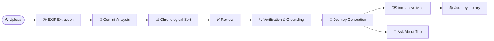
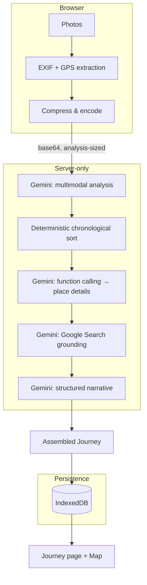

<div align="center">

# صوِّر — Sawwer

**Turn your travel photos into a story worth remembering.**

Sawwer reads the photos from a trip you've already taken and gives you back the
journey — the places you walked through, in the order you actually walked them,
with their history verified against real sources.


<p align="center">
  🌐 <a href="https://sawwer.vercel.app"><strong>Live Demo</strong></a>
</p>
</div>

<br />

<table>
<tr>
<td width="25%" valign="top">

**🧭 AI journey reconstruction**
Gemini reads your photos and identifies the places in them.

</td>
<td width="25%" valign="top">

**🕒 Real chronology**
Order comes from each photo's own EXIF timestamp — never a guess.

</td>
<td width="25%" valign="top">

**🗺️ Interactive map**
Every stop plotted on OpenStreetMap, no API key required.

</td>
<td width="25%" valign="top">

**📚 Verified history**
Facts are grounded in live search results, with sources shown.

</td>
</tr>
</table>

<br />

---

## Table of contents

- [Project overview](#project-overview)
- [Features](#features)
- [How it works](#how-it-works)
- [AI architecture](#ai-architecture)
- [Technology stack](#technology-stack)
- [Screenshots](#screenshots)
- [Installation](#installation)
- [Environment variables](#environment-variables)
- [Deployment](#deployment)
- [Project structure](#project-structure)
- [Future improvements](#future-improvements)
- [Contributors](#contributors)
- [License](#license)

---

## Project overview

**Sawwer** (صوِّر — the Arabic imperative *"capture"*) is an AI-powered tourism
memory experience built for Saudi heritage travel. It is designed for the moment
*after* the trip: you're home, your gallery has forty photos from Diriyah or AlUla
or Historic Jeddah, and you can no longer remember which building was which, what
order the day happened in, or why any of it mattered.

Sawwer solves this by reconstructing the journey from the photos alone —
identifying the landmarks, verifying their history against real sources, ordering
everything by when it was actually captured, and rendering the result as an
interactive story you scroll through.

### Why this isn't a photo gallery

A gallery shows you images. Sawwer tells you a *story*:

| A gallery | Sawwer |
|---|---|
| Grid of thumbnails | A scrolling, narrated journey |
| No context | Landmark names, heritage details, verified facts |
| No order | Chronological timeline from real capture data |
| No place | Every stop plotted on an interactive map |
| Static | Answers questions about your own trip |

### The experience

A traveller opens Sawwer, drops in their photos, and watches a narrated
processing sequence read and understand each one. They confirm a short review of
the detected stops, and then step into a cinematic, scrollable journey — hero
cover, one immersive section per stop, a map of the whole trip, and a closing
screen with the story's shape in numbers. From there, they can ask the journey
questions directly: *"Where did I go first?"*, *"What's the story behind this
building?"*

---

## Features

- 🧠 **AI-powered journey reconstruction** — Gemini's multimodal understanding reads every photo and identifies landmarks, heritage elements, and visible context
- 🕒 **Automatic chronological timeline** — stops are ordered by when the photos were actually taken, not by upload order or guesswork
- 📷 **EXIF-based photo ordering** — real capture timestamps, extracted client-side, drive the entire sequence
- 🗺️ **Interactive map** — every stop plotted on OpenStreetMap with a chronological route line, no billing account needed
- ✍️ **AI-generated storytelling** — a warm, literary narrative written around your actual photos, kept strictly separate from verified fact
- 🌐 **Multilingual interface** — Arabic-first with full RTL, English available from the header
- 💾 **Offline local storage** — journeys and photos live in the browser via IndexedDB; nothing is uploaded except what's needed for analysis
- 📍 **Smart place recognition** — function calling resolves landmark names to official names and coordinates
- 📚 **Historical facts with citations** — every verified fact is grounded in a live search result, source included
- 🗂️ **Journey library** — every trip you build is saved and revisitable, like a personal travel archive
- ❓ **Ask about your trip** — a contextual Q&A panel that answers only from your journey's own data
- 🎭 **Honest about uncertainty** — low-confidence places are marked unconfirmed rather than asserted; a demo mode makes the whole flow explorable without any credentials

---

## How it works

1. **Upload** — drop in the photos from your trip (up to 12, JPG/PNG/WEBP)
2. **EXIF extraction** — capture timestamps and GPS are read client-side, from the original files, before anything is compressed
3. **Gemini analysis** — each photo is read for landmarks, heritage elements, and visual context
4. **Chronological sort** — photos are ordered by their real capture time, with a deterministic fallback chain for photos with partial or missing data
5. **Grouping** — photos taken at the same place and time are merged into a single stop
6. **Review** — a quick screen shows the detected stops and their order before anything is generated, so you can rename or remove a stop
7. **Verification** — place names are resolved via function calling, and one historical fact per stop is grounded in live search results
8. **Journey generation** — Gemini writes the narrative for each stop, strictly separated from the verified facts
9. **Interactive map** — every located stop is plotted on OpenStreetMap, connected by a chronological route
10. **Ask about your trip** — a floating panel answers questions using only your journey's own data



---

## AI architecture

Sawwer's core design principle: **the language model never decides chronology.**
Order is computed deterministically from each photo's own metadata before Gemini
is ever called for narrative, and the model's response schema for journey
composition contains no ordering, grouping, or image-assignment fields — only
`{ stopId, title, narrative }`. A model response cannot reorder a timestamped
trip because the data it returns has no way to express an order.

| Capability | What it does | Where |
|---|---|---|
| **Multimodal understanding** | Reads every photo and returns place candidates, heritage elements, and an honest confidence score | `analyzeImages` |
| **Structured outputs** | Every AI response is generated against a typed JSON schema and re-validated with Zod — no prose parsing | all Gemini calls |
| **Function calling** | Gemini resolves place names via a `getPlaceDetails` tool; the server executes the lookup and returns real data | `resolvePlaces` |
| **Google Search grounding** | Historical facts are retrieved from live search results; citations come from the grounding metadata, never the model's own claim | `groundPlaceFact` |
| **EXIF extraction** | Capture timestamps and GPS are read client-side from the original file, before any compression | `metadata.ts` |
| **OpenStreetMap** | The journey map renders on free OSM tiles via Leaflet — no API key, no billing | `LeafletJourneyMap.tsx` |
| **Local storage** | Journeys and photos persist in IndexedDB; nothing leaves the device except what analysis needs | `storage/journeys.ts` |

**How uncertainty is handled:**

- A landmark is only named when the model is reasonably confident; low-confidence
  places are marked **غير مؤكد** (unconfirmed) rather than asserted
- The narrative is explicitly forbidden from containing dates, dynasties, or
  historical claims — those live only in the separate, visually distinct
  verified-fact block
- A fact is marked verified **only** when Google Search grounding actually
  returned citations; everything else renders without one
- Stop IDs, coordinates, source URLs, and map links are attached by the
  application's own code after generation — a hallucinated URL can never reach
  the page



---

## Technology stack

| Category | Technology |
|---|---|
| **Frontend** | Next.js 16 (App Router), React 19, TypeScript |
| **Backend** | Next.js Route Handlers (Node.js runtime) |
| **AI** | Google Gemini API via `@google/genai` — multimodal, structured output, function calling, Search grounding |
| **Maps** | Leaflet + OpenStreetMap (no API key required) |
| **Places** | Google Places API (New) — optional, with an offline gazetteer fallback |
| **Styling** | Tailwind CSS v4 (CSS-first config), self-hosted Thmanyah typeface |
| **Validation** | Zod — schema validation at every AI and API boundary |
| **Storage** | IndexedDB (client-side, no backend database) |
| **EXIF parsing** | exifr |
| **Deployment** | Vercel (or any Node.js host) |
| **Tooling** | ESLint, TypeScript strict mode |

---

## Screenshots

### Landing page


### Upload


### Processing


### Review


### Journey


---

## Installation

```bash
git clone https://github.com/mneerh/sawwer.git
cd sawwer
npm install
npm run dev
```

Open [http://localhost:3000](http://localhost:3000). **The app works with no
configuration at all** — see [Demo mode](#demo-mode) below.

```bash
npm run build   # production build
npm run start   # serve the production build
npm run lint    # ESLint
```

### Demo mode

Demo mode is not a mock of the API — it's a separate, clearly-labelled content
path, triggered automatically whenever `GEMINI_API_KEY` is absent. Demo journeys
carry a visible **محتوى عرض توضيحي** badge and are never presented as live AI
output. The sample journey (*يوم في الدرعية* — "A day in Diriyah") is always
available at `/journey/demo-diriyah`, and its illustrations are inline SVG, so
the demo needs no assets and no network connection.

---

## Environment variables

Copy `.env.example` to `.env.local`. 
```env
GEMINI_API_KEY=
```

---

## Deployment

### Vercel

Sawwer is a standard Next.js App Router project and deploys to Vercel with no
special configuration:

1. Import the repository into Vercel
2. Add any of the [environment variables](#environment-variables) you want live
   (all optional)
3. Deploy — Vercel detects the Next.js framework automatically

### Local / self-hosted

```bash
npm install
npm run build
npm run start
```

Runs on any Node.js host. There is no database to provision — persistence is
entirely client-side via IndexedDB.

---

## Project structure

```
sawwer/
├── src/
│   ├── app/                     Routes and API route handlers
│   │   ├── api/
│   │   │   ├── analyze/         Multimodal analysis → detected places
│   │   │   ├── journey/         Function calling + grounding + composition
│   │   │   ├── ask/             Scoped Q&A over one journey
│   │   │   └── config/          Reports which capabilities are live
│   │   ├── create/               Upload → processing → review flow
│   │   ├── journey/[id]/         The immersive journey page
│   │   └── journeys/             Personal journey library
│   ├── components/
│   │   ├── layout/               Header, footer, logo
│   │   ├── upload/                The create flow (dropzone, review, processing)
│   │   ├── journey/               The journey experience (hero, stops, ask panel)
│   │   ├── map/                   Leaflet + OpenStreetMap integration
│   │   ├── media/                 Image resolution (demo / stored / direct)
│   │   └── ui/                    Shared primitives (scroll reveal, etc.)
│   ├── lib/
│   │   ├── ai/                    gemini.ts, prompts.ts, schemas.ts, pipeline.ts
│   │   ├── google/                Places API + keyless Maps deep links
│   │   ├── storage/                IndexedDB persistence layer
│   │   ├── i18n/                   Arabic/English dictionary + context
│   │   ├── chronology.ts           Deterministic sort, day-splitting, grouping
│   │   ├── metadata.ts             EXIF extraction
│   │   └── images.ts               Client-side resize/compress pipeline
│   └── data/
│       └── demo-journey.ts         Hand-written demo content, clearly labelled
├── public/
│   └── fonts/                     Self-hosted Thmanyah typeface
└── docs/
    └── images/                     Screenshots referenced in this README
```

**Key folders:**

- **`app/`** — routing and HTTP only; every handler validates input, delegates to
  `lib/ai/pipeline.ts`, and responds
- **`lib/ai/`** — the only place the model is spoken to; prompts are isolated
  from the calls that use them
- **`lib/chronology.ts`** — pure, dependency-free, deterministic logic that
  decides the shape of every journey before Gemini writes a word
- **`lib/storage/`** — the entire persistence layer; swapping this module for a
  real backend is the only change needed to make journeys shareable

---

## Future improvements

- Shared, shareable journey links (requires moving persistence off-device)
- Cloud synchronization across devices
- Video clip support alongside photos
- Improved place recognition for less iconic landmarks
- Collaborative trips (multiple contributors to one journey)
- AI-generated trip summaries across multiple journeys

---

## Contributors

Developed by:

### [Muneera Alsaeed](https://github.com/mneerh)

### [Sara Bin Zuryban](https://github.com/sarasultanz)


---

## License

All rights reserved © Muneera Alsaeed & Sara Bin Zuryban.

This repository is provided for demonstration purposes only. No part of this
project may be copied, modified, or redistributed without prior permission from
the authors.
