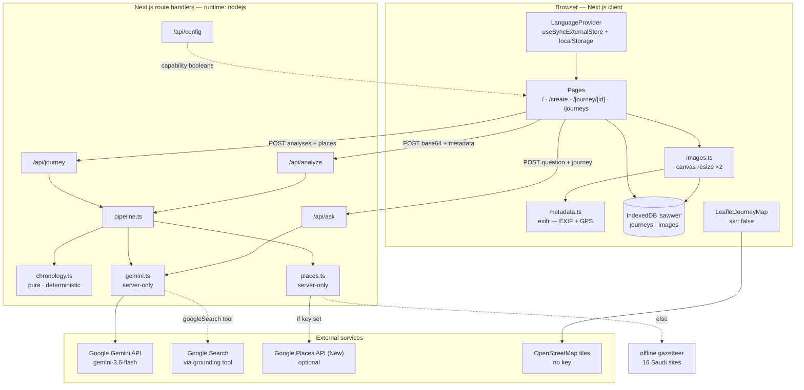
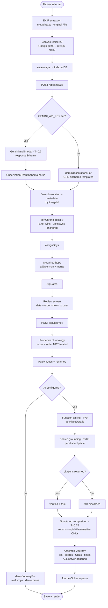
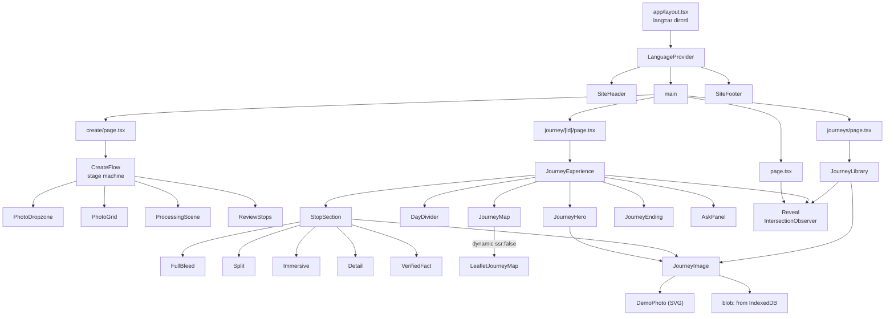
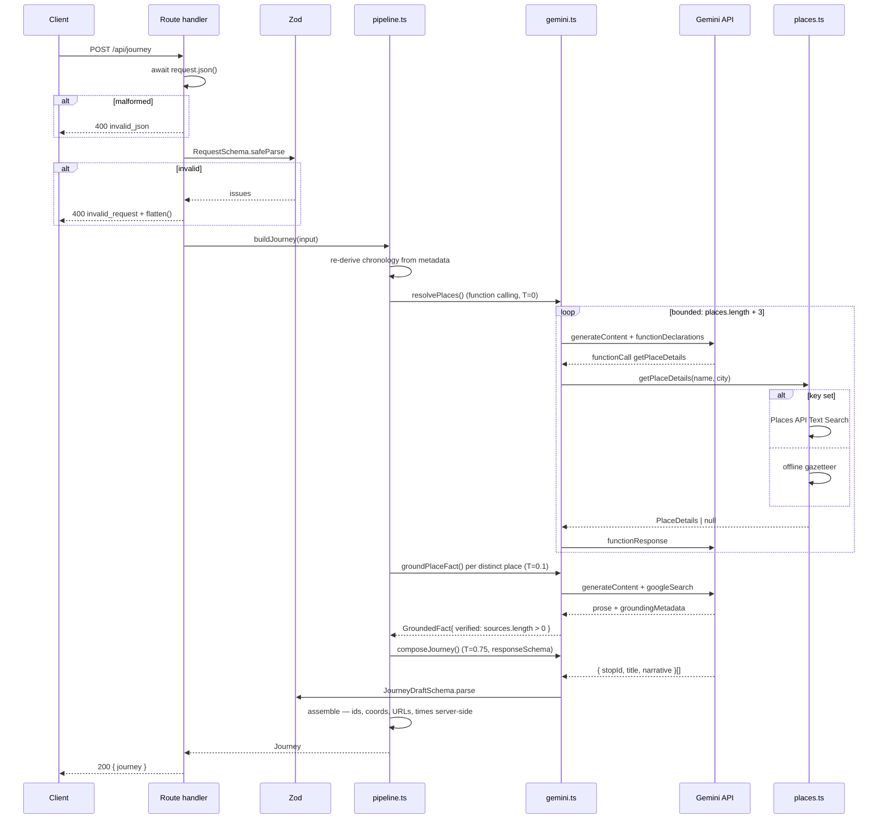
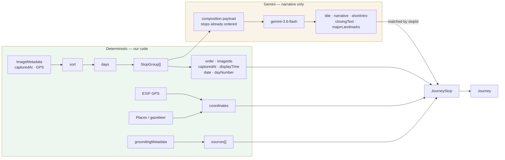
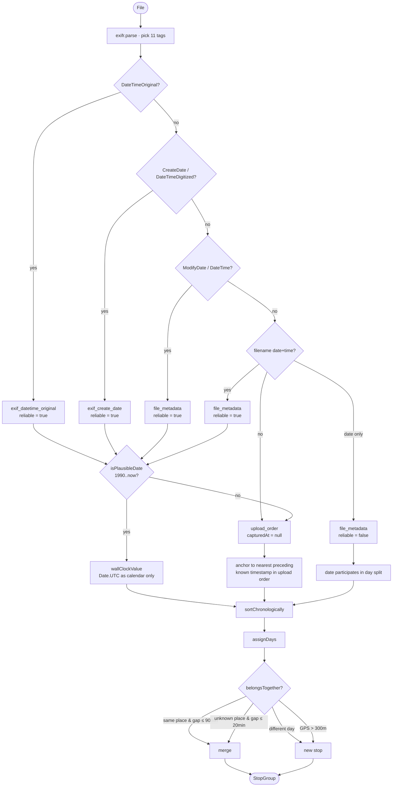
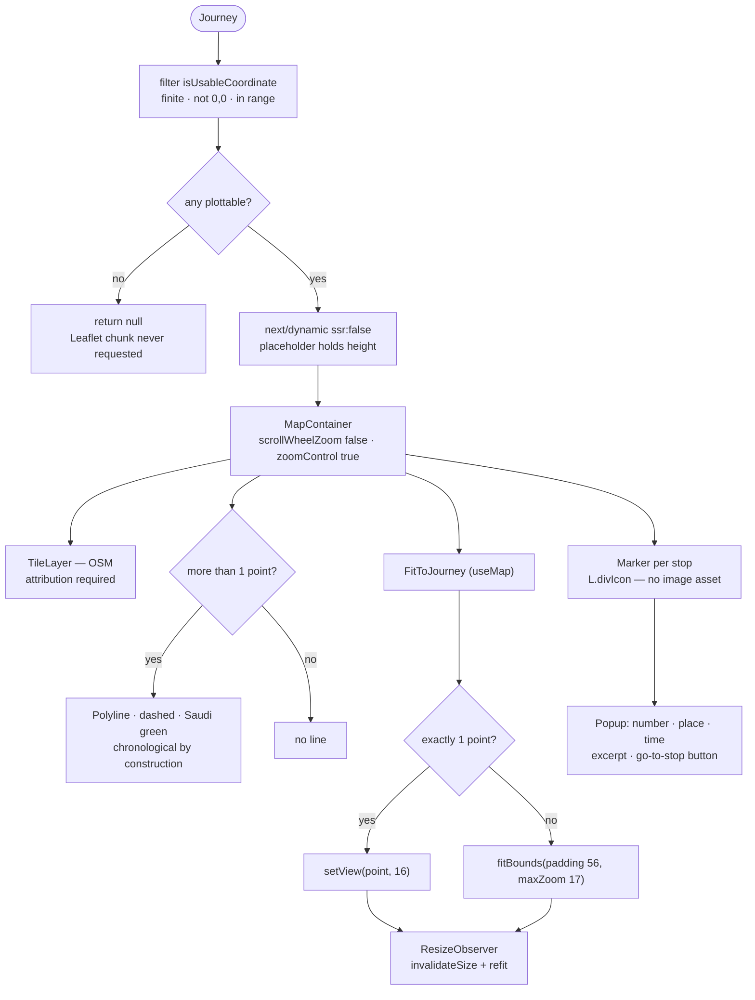

# Sawwer — Technical Architecture Document

**Repository:** https://github.com/mneerh/sawwer
**Commit documented:** `fe0067c`
**Date:** 2026-08-09

This document describes **only what is implemented in the repository at the commit
above**. Nothing here is aspirational. Where a capability is commonly expected but
absent, it is called out explicitly rather than omitted.

---

## Table of contents

1. [Project overview](#1-project-overview)
2. [Frontend](#2-frontend)
3. [Backend](#3-backend)
4. [Gemini implementation](#4-gemini-implementation)
5. [Image processing](#5-image-processing)
6. [EXIF system](#6-exif-system)
7. [Map implementation](#7-map-implementation)
8. [AI pipeline](#8-ai-pipeline)
9. [Data models](#9-data-models)
10. [Validation](#10-validation)
11. [Storage](#11-storage)
12. [Demo mode](#12-demo-mode)
13. [Security](#13-security)
14. [Libraries](#14-libraries)
15. [Project tree](#15-project-tree)
16. [Environment variables](#16-environment-variables)
17. [Complete user flow](#17-complete-user-flow)
18. [Design system](#18-design-system)
19. [Architecture diagrams](#19-architecture-diagrams)
20. [Limitations](#20-limitations)
21. [Hackathon explanation](#21-hackathon-explanation)

---

## 1. Project overview

### What it is

Sawwer turns photographs a traveller **already has** into a chronologically ordered,
narratively written, source-verified journey. The product thesis is that the photos
survive a trip but the journey does not — the order, the names, and the significance
are lost.

### Architecture in one sentence

A single **Next.js 16 App Router** application where the browser owns photo handling,
metadata extraction, chronology display and persistence, while four **Node.js route
handlers** own every call to Gemini and Google Places — so no credential ever reaches
the client.

### The central architectural decision

**Chronology is computed deterministically from photo metadata; the language model is
never asked for sequence.**

This is the load-bearing decision in the codebase. It shapes the schema
([`schemas.ts`](../src/lib/ai/schemas.ts)), the pipeline
([`pipeline.ts`](../src/lib/ai/pipeline.ts)), the prompts
([`prompts.ts`](../src/lib/ai/prompts.ts)) and the review UI
([`ReviewStops.tsx`](../src/components/upload/ReviewStops.tsx)).

Concretely, the model's journey-composition response schema contains **no** order,
grouping, image assignment or timestamps — only `{ stopId, title, narrative }`
([`gemini.ts:85-98`](../src/lib/ai/gemini.ts)). Stops are built by mapping over our own
computed groups, and the model's text is attached by `stopId` lookup
([`pipeline.ts`](../src/lib/ai/pipeline.ts), `buildJourney`). A model response
therefore **cannot** reorder a timestamped trip — not by policy, but structurally.

### High-level system flow

```
Browser                                    Server (Node route handlers)
───────                                    ───────────────────────────
select photos
  ├─ extract EXIF from original File
  ├─ downscale ×2 via <canvas>
  └─ persist blobs to IndexedDB
        │
        │  POST /api/analyze  { images[] (base64), metadata[], tripHint }
        └──────────────────────────────────►
                                            Gemini multimodal → observations
                                            join observations + metadata
                                            sort → assign days → group stops
        ◄──────────────────────────────────
        { analyses[], detectedPlaces[], tripStartDate, tripEndDate,
          dayCount, photosWithoutTimestamp, unplacedImageIds[], mode }

review screen (user confirms / renames / removes)
        │
        │  POST /api/journey  { journeyId, analyses[], places[], tripName, imageIds[] }
        └──────────────────────────────────►
                                            re-derive chronology from metadata
                                            apply keeps + renames
                                            Gemini function calling → Places
                                            Gemini Search grounding → facts
                                            Gemini structured output → narrative
                                            assemble Journey
        ◄──────────────────────────────────  { journey }
save Journey to IndexedDB
route to /journey/[id]
```

### Client / server responsibilities

| Concern | Owner | Rationale |
|---|---|---|
| File selection, decode, downscale | Client | Avoids uploading full-resolution originals |
| EXIF + GPS extraction | Client | Privacy: metadata is read on-device; only required fields are sent |
| Photo blob persistence | Client (IndexedDB) | No backend exists; photos never leave the device except the downscaled analysis copy |
| Chronology sort / group / day-split | **Server** (`chronology.ts` imported by `pipeline.ts`) | Single source of truth; the client cannot present one order and receive another |
| Gemini calls | Server only | `GEMINI_API_KEY` must not reach the browser |
| Google Places calls | Server only | Same |
| Date/time **formatting** | Client (`datetime.ts`) | Locale-dependent, must follow the AR/EN switch |
| Map rendering | Client only (`ssr: false`) | Leaflet touches `window` at import time |

Note that `chronology.ts` is **not** marked `server-only` — it is pure, dependency-free
logic that could run in either environment. Today it is imported only by
`pipeline.ts` (server) and `demo-journey.ts`.

### Request lifecycle (example: `POST /api/analyze`)

1. `CreateFlow.runAnalysis` builds the body and `fetch`es.
2. Next routes to [`src/app/api/analyze/route.ts`](../src/app/api/analyze/route.ts),
   `runtime = "nodejs"`, `maxDuration = 60`.
3. `await request.json()` inside `try/catch` → `400 invalid_json` on parse failure.
4. `RequestSchema.safeParse` (Zod) → `400 invalid_request` with `error.flatten()`.
5. `runAnalysis()` in `pipeline.ts`:
   - `isAiConfigured()` decides live vs demo.
   - Live: `analyzeImages()` → Gemini → `ObservationResultSchema.parse`.
   - Observations are joined to the client's metadata by `imageId`; any missing
     observation is backfilled with `emptyObservation()`, any missing metadata with
     `fallbackMetadata()`.
   - `buildChronology()` → `sortChronologically` → `assignDays` → `groupIntoStops` →
     `tripDates`.
6. `NextResponse.json(outcome)`.
7. Any throw → logged server-side, `502 analysis_failed` with `error.message`.

### Folder structure

See [§15 Project tree](#15-project-tree). The shape is: `app/` routes only,
`components/` by feature, `lib/` for logic, `data/` for demo content.

---

## 2. Frontend

### Framework

**Next.js 16.3.0** (App Router) with **React 19.2.8** and **TypeScript 5.9.3**.
Turbopack is the bundler (Next 16 default). Configured in
[`next.config.ts`](../next.config.ts) with one option:

```ts
turbopack: { root: path.resolve(import.meta.dirname) }
```

**Why:** without pinning `root`, Turbopack walks up the directory tree past the repo
and picks up an unrelated `package-lock.json` from the home directory, emitting a
build warning. This was observed and fixed during development.

**Why Next.js at all:** the project needs server-side execution for API secrets and a
zero-config React build in a hackathon timeframe. App Router route handlers give
server endpoints without a separate backend service.

### Routing

File-system routing, App Router. Five routes plus four API handlers:

| File | Route | Rendering |
|---|---|---|
| [`app/page.tsx`](../src/app/page.tsx) | `/` | Static (`○`), but marked `"use client"` |
| [`app/create/page.tsx`](../src/app/create/page.tsx) | `/create` | Static shell → client `CreateFlow` |
| [`app/journey/[id]/page.tsx`](../src/app/journey/[id]/page.tsx) | `/journey/[id]` | Dynamic (`ƒ`) |
| [`app/journeys/page.tsx`](../src/app/journeys/page.tsx) | `/journeys` | Static shell → client `JourneyLibrary` |

`journey/[id]/page.tsx` is an async server component that awaits the Next 16 promise-based
params and passes the id down:

```tsx
export default async function JourneyPage({ params }: { params: Promise<{ id: string }> }) {
  const { id } = await params;
  return <JourneyExperience journeyId={id} />;
}
```

The journey **content** is not server-rendered — it lives in IndexedDB, so
`JourneyExperience` fetches it client-side after mount.

Navigation uses `next/link` (`<Link>`) and `useRouter().push` (in `CreateFlow` after a
journey is built).

### State management

**No state library.** There is no Redux, Zustand, Jotai, React Query or SWR.

| Kind of state | Mechanism | File |
|---|---|---|
| Create-flow machine (`upload`→`processing`→`review`) | `useState` + `useRef` in one component | [`CreateFlow.tsx`](../src/components/upload/CreateFlow.tsx) |
| Locale | React Context + `useSyncExternalStore` over `localStorage` | [`i18n/context.tsx`](../src/lib/i18n/context.tsx) |
| Journey / library data | `useState` populated from IndexedDB in `useEffect` | `JourneyExperience`, `JourneyLibrary` |
| Ask panel conversation | `useState<Message[]>`, in-memory only | [`AskPanel.tsx`](../src/components/journey/AskPanel.tsx) |
| Scroll reveal | Direct DOM attribute write, deliberately **not** React state | [`Reveal.tsx`](../src/components/ui/Reveal.tsx) |

**Why no library:** the app has exactly one multi-step flow, and its state is scoped to
a single component's lifetime. Non-visual data (`analyses`, `journeyId`) is held in
`useRef` because it must survive re-render without causing one.

Two implementation details worth noting:

- `analysesRef` and `journeyIdRef` are refs, not state — they are transport data, not
  render inputs.
- `ProcessingScene` is mounted with `key={phase}` so a phase change remounts it and
  resets its internal step counter, instead of resetting state inside an effect
  (which the `react-hooks/set-state-in-effect` lint rule forbids).

### Styling

**Tailwind CSS v4.3.3**, configured entirely in CSS — there is **no `tailwind.config.js`**.
PostCSS config is one plugin ([`postcss.config.mjs`](../postcss.config.mjs)):

```js
plugins: { "@tailwindcss/postcss": {} }
```

The design system lives in an `@theme` block in
[`globals.css`](../src/app/globals.css), which generates Tailwind utilities from CSS
custom properties:

```css
@theme {
  --color-green: #006c35;
  --color-green-deep: #064e35;
  --color-sand: #d9c5a4;
  --color-shell: #faf8f3;
  --color-ink: #2e2925;
  /* … */
  --font-sans: "Thmanyah", ui-sans-serif, system-ui, sans-serif;
  --font-serif: "Thmanyah Serif", "Thmanyah", ui-serif, Georgia, serif;
  --font-display: "Thmanyah Display", "Thmanyah Serif", ui-serif, Georgia, serif;
}
```

This yields `bg-green`, `text-ink`, `font-display` etc. **Why v4 CSS-first config:** it
keeps one file as the single source of truth for the palette and typography, and the
same custom properties are reused directly by hand-written CSS (Leaflet overrides,
`.sawwer-pin`) that Tailwind utilities cannot reach.

Styling is otherwise utility classes inline in JSX. There is no CSS-in-JS and no CSS
modules. `globals.css` (336 lines) holds: `@font-face` declarations, the `@theme`
block, keyframes, the `.reveal` primitive, and the Leaflet skin.

### Component architecture

Feature-foldered, all presentational components are leaf-level:

```
components/
  layout/    SiteHeader, SiteFooter, Logo          — app chrome
  upload/    CreateFlow, PhotoDropzone, PhotoGrid,
             ProcessingScene, ReviewStops          — the create flow
  journey/   JourneyExperience, JourneyHero,
             StopSection, VerifiedFact,
             JourneyEnding, AskPanel,
             JourneyLibrary                        — the journey experience
  map/       JourneyMap, LeafletJourneyMap         — map section + Leaflet
  media/     JourneyImage, DemoPhoto               — image resolution + illustrations
  ui/        Reveal                                — scroll-reveal primitive
```

`CreateFlow` and `JourneyExperience` are the two container components; everything else
receives props. 24 of 25 components are `"use client"`; the exception is
[`DemoPhoto.tsx`](../src/components/media/DemoPhoto.tsx), which is a pure server
component rendering static SVG.

`StopSection` is the most structurally interesting: it selects one of four layout
variants by `(stop.order - 1) % 4` so a scrolling journey does not read as a list of
identical cards:

```tsx
const variant = (stop.order - 1) % 4;
const content = { 0: <FullBleed …/>, 1: <Split …/>, 2: <Immersive …/>, 3: <Detail …/> }[variant];
```

### Animation

**No animation library.** No Framer Motion, no GSAP, no react-spring.

Three mechanisms, all CSS/DOM:

1. **Scroll reveal** — [`Reveal.tsx`](../src/components/ui/Reveal.tsx). An
   `IntersectionObserver` writes `element.dataset.visible = "true"` **directly to the
   DOM**, then disconnects. CSS does the rest:

   ```css
   .reveal { opacity: 0; transform: translateY(26px); transition: opacity .9s …, transform .9s …; }
   .reveal[data-visible="true"] { opacity: 1; transform: none; }
   ```

   **Why direct DOM writes:** a reveal is a one-way visual effect. Routing it through
   React state would re-render a whole section to flip one attribute, on a page that
   can hold dozens of them.

2. **Keyframes** declared in `@theme` (`--animate-rise`, `--animate-fade-in`,
   `--animate-drift`) → utilities `animate-fade-in`, `animate-drift`. `drift` is a
   14s Ken-Burns loop used on the `Immersive` stop variant.

3. **Parallax** — [`JourneyHero.tsx`](../src/components/journey/JourneyHero.tsx). A
   `scroll` listener inside `requestAnimationFrame` translates the cover at 0.32× scroll
   speed, and stops computing once past the first viewport.

`prefers-reduced-motion: reduce` collapses all animations and transitions to 0.01ms and
disables smooth scrolling ([`globals.css`](../src/app/globals.css)).

### RTL implementation

Arabic is the default and is RTL. Implementation:

- `<html lang="ar" dir="rtl">` is the **server-rendered default** in
  [`layout.tsx`](../src/app/layout.tsx), with `suppressHydrationWarning`.
- `LanguageProvider` updates `document.documentElement.lang` / `.dir` in an effect when
  the locale changes.
- Layout uses **CSS logical properties throughout**: `ms-*`/`me-*`, `ps-*`/`pe-*`,
  `start-*`/`end-*`, `border-s-*`, `text-start`. There are no `left`/`right` utilities
  in layout code.
- Direction-sensitive **glyphs** are switched explicitly where logical properties
  cannot help — the reorder arrows in
  [`PhotoGrid.tsx`](../src/components/upload/PhotoGrid.tsx):

  ```tsx
  const backGlyph    = dir === "rtl" ? "→" : "←";
  const forwardGlyph = dir === "rtl" ? "←" : "→";
  ```

- `rtl:space-x-reverse` is used on the overlapping thumbnail stacks.

### Internationalization

Hand-rolled, no i18n library (no `next-intl`, no `react-i18next`).

[`dictionary.ts`](../src/lib/i18n/dictionary.ts) (353 lines) exports `ar` and `en`.
The type contract is derived from Arabic:

```ts
export const ar = { /* … */ };            // deliberately NOT `as const`
export type Dictionary = typeof ar;        // widened shape = the contract
export const en: Dictionary = { /* … */ }; // must satisfy it
```

**Why not `as const`:** literal types would make every English string a type error.
Widening `ar` makes the compiler enforce that `en` has exactly the same keys and the
same function arities. Pluralisation is done with inline functions in the dictionary,
e.g.:

```ts
stops: (n: number) => `${n} ${n === 1 ? "محطة" : n === 2 ? "محطتان" : "محطات"}`,
```

[`context.tsx`](../src/lib/i18n/context.tsx) reads the stored locale through
**`useSyncExternalStore`** rather than copying `localStorage` into state inside an
effect:

```ts
const locale = useSyncExternalStore(subscribe, getSnapshot, getServerSnapshot);
```

**Why:** `localStorage` is external state. `getServerSnapshot` returns `"ar"`, matching
the server-rendered `<html>`, so hydration is consistent; the stored preference is
applied by React on the client. This also satisfies the React Compiler lint rule that
forbids synchronous `setState` in an effect body.

`useLanguage()` returns a working Arabic default when no provider is present, so
components can be rendered in isolation without crashing.

### Responsive strategy

Mobile-first Tailwind breakpoints, primarily `sm:` (640px) and `lg:` (1024px); `md:`
is used once (header nav). Techniques in use:

- `clamp()` for fluid display type: `text-[clamp(2.6rem,8vw,5.2rem)]` (journey H1).
- Grid collapse: `lg:grid-cols-2`, `sm:grid-cols-3`, `lg:grid-cols-[1.15fr_0.85fr]`.
- Aspect-ratio boxes (`aspect-[4/5]`, `aspect-[16/10]`) so images reserve space.
- Element hiding for composition-only decoration: the hero's offset photos are
  `hidden sm:block` / `hidden lg:block`.
- Map height steps `h-[26rem] sm:h-[32rem]`, plus a `ResizeObserver` refit (see §7).

Verified at 1280×800 and 375×812 during development.

### Font loading

**Thmanyah**, self-hosted, three families, 14 `@font-face` declarations in
[`globals.css`](../src/app/globals.css). `next/font` is **not** used.

| Family | CSS family name | Weights | Role |
|---|---|---|---|
| Thmanyah Sans | `"Thmanyah"` | 300, 400, 500, 700, 900 | UI, labels, buttons |
| Thmanyah Serif Text | `"Thmanyah Serif"` | 300, 400, 500, 700 | narrative body copy |
| Thmanyah Serif Display | `"Thmanyah Display"` | 300, 400, 500, 700, 900 | headlines |

All `woff2`, all `font-display: swap`, served from `/public/fonts` (1.2 MB total). The
license PDF is committed alongside at `public/fonts/THMANYAH-LICENSE.pdf`.

**Why not `next/font/local`:** the three families are mapped to three Tailwind theme
tokens (`--font-sans`, `--font-serif`, `--font-display`) consumed by both Tailwind
utilities and hand-written CSS (including inline SVG `font-family` attributes in the
Leaflet pin and popup). Plain `@font-face` keeps one declaration site for all consumers.

**Trade-off:** `next/font` would add automatic preloading and a self-hosted fallback
metric override to reduce layout shift. That is not implemented.

### Icons

**No icon library.** No lucide, no heroicons, no react-icons.

Icons are either inline hand-written SVG (the camera glyph in
[`PhotoDropzone.tsx`](../src/components/upload/PhotoDropzone.tsx), the missing-photo
placeholder in [`JourneyImage.tsx`](../src/components/media/JourneyImage.tsx)) or Unicode
glyphs used as UI affordances (`✓ ✕ ↓ ⤢ ◎ ✦ ← →`). **Why:** fewer than ten icons are
needed; a dependency would outweigh them.

### Image optimization

**`next/image` is not used anywhere.** Both image call sites use `` with an
explicit ESLint suppression and a stated reason:

```tsx
// Blob URLs from IndexedDB can't go through next/image, which needs a
// path or a configured remote host.
// eslint-disable-next-line @next/next/no-img-element

```

**Why:** every user photo is a `blob:` object URL created from an IndexedDB `Blob`.
`next/image` requires a static path or a configured remote pattern and cannot optimise
blob URLs.

Optimisation is instead done **at upload time** in the browser (see §5): two canvas
re-encodes produce a 1800px stored copy and a 1024px analysis copy. `loading="lazy"` and
`decoding="async"` are set on non-priority images; the journey cover passes
`priority` → `loading="eager"`.

### Upload implementation

[`PhotoDropzone.tsx`](../src/components/upload/PhotoDropzone.tsx) +
[`CreateFlow.addFiles`](../src/components/upload/CreateFlow.tsx).

- A visually hidden `<input type="file" multiple accept="image/jpeg,image/jpg,image/png,image/webp">`
  triggered by a styled button.
- `event.target.value = ""` is reset after each change so the same file can be
  re-selected after removal.
- Validation before processing: MIME type against `ACCEPTED_TYPES`, size against
  `MAX_FILE_BYTES` (20 MB), count against `MAX_FILES` (12). Each failure pushes a
  localised message into an array rendered in a `role="alert"` list.
- Files are processed **sequentially** (`for … of` with `await`), not in parallel —
  each `prepareImage` decodes a full-resolution bitmap, and parallelising 12 of them
  risks memory pressure on mobile.

### Drag & drop implementation

Native HTML5 drag-and-drop on the dropzone container — **no `react-dropzone`**:

```tsx
onDragOver={(e) => { e.preventDefault(); if (!disabled && !full) setDragging(true); }}
onDragLeave={() => setDragging(false)}
onDrop={(e) => { e.preventDefault(); setDragging(false); if (disabled || full) return; handleFiles(e.dataTransfer.files); }}
```

`dragging` drives a border/background change. **Why native:** the whole requirement is
three handlers and a boolean.

**Photo reordering does not use drag-and-drop.** It uses explicit
back/forward arrow buttons in `PhotoGrid`, with `aria-label`s and disabled states at the
ends. **Why:** arrow buttons are keyboard-accessible and work on touch without a
gesture library; drag-reorder would need a dependency and a separate mobile solution.

---

## 3. Backend

### Server architecture

Four Next.js App Router **route handlers**. There is no separate server, no Express, no
database, no ORM, no queue, no auth layer, no middleware file.

All four declare `export const runtime = "nodejs"` — required because `@google/genai`
is not edge-compatible.

| Route | Method | `maxDuration` | Other config |
|---|---|---|---|
| `/api/analyze` | POST | 60 | — |
| `/api/journey` | POST | 120 | — |
| `/api/ask` | POST | 60 | — |
| `/api/config` | GET | — | `dynamic = "force-dynamic"` |

Server-only modules are fenced with `import "server-only"`:
[`gemini.ts`](../src/lib/ai/gemini.ts), [`pipeline.ts`](../src/lib/ai/pipeline.ts),
[`places.ts`](../src/lib/google/places.ts). If a client component ever imports one, the
build fails rather than leaking key-reading code into a browser bundle.

> Implementation note: `server-only` is **not** a direct dependency in `package.json`.
> Next.js ships it at `next/dist/compiled/server-only` and aliases the bare specifier
> internally, so the import resolves without installation.

### Error handling

Every handler follows the same three-tier shape:

```ts
let body: unknown;
try { body = await request.json(); }
catch { return NextResponse.json({ error: "invalid_json" }, { status: 400 }); }

const parsed = RequestSchema.safeParse(body);
if (!parsed.success) {
  return NextResponse.json({ error: "invalid_request", details: parsed.error.flatten() }, { status: 400 });
}

try { /* work */ }
catch (error) {
  console.error("[api/analyze]", error);
  return NextResponse.json({ error: "analysis_failed", message: messageOf(error) }, { status: 502 });
}
```

Tier 1 = malformed JSON (400). Tier 2 = schema violation (400 + flattened Zod issues).
Tier 3 = upstream/unexpected failure (502, logged server-side).

**Degradation inside the pipeline** is separate from the outer 502. In
`buildJourney`, non-essential steps are individually wrapped so one failure cannot
lose the journey:

- Function-calling place resolution — `try/catch`, logs, continues with an empty map.
- Per-place direct lookup — `try/catch` per place.
- Per-place grounding — `try/catch` per place, returns `null`, that stop simply gets no
  verified fact.

Only `composeJourney` is unguarded: without narrative there is no journey, so its
failure correctly propagates to a 502.

On the client, a 502 sets `fatalError`, which renders a recovery screen with **حاول مرة أخرى**
(returns to `review` if stops exist, else `upload`) and **رجوع**. Uploaded photos are
saved to IndexedDB *before* generation, so a failure never loses them.

### Retry logic

**None is implemented.** There is no automatic retry, no exponential backoff, no
circuit breaker, and no rate-limit handling anywhere in the codebase. A transient
Gemini failure surfaces as a 502 and the user presses the retry button. The one
bounded loop that exists is the function-calling turn limit
(`maxTurns = places.length + 3`), which is a runaway guard, not a retry.

This is a genuine gap — see §20.

### Security

Summarised here, detailed in [§13](#13-security): all credentials are read via
`process.env` inside `server-only` modules; no `NEXT_PUBLIC_*` secret exists; every
request body is Zod-validated with explicit bounds; all model-supplied URLs are
discarded in favour of server-attached ones.

### Endpoint reference

---

#### `POST /api/analyze`

**File:** [`src/app/api/analyze/route.ts`](../src/app/api/analyze/route.ts)

**Input**

```ts
{
  images: Array<{ imageId: string; mimeType: string; data: string }>,  // 1..12, base64 (no data: prefix)
  metadata: ImageMetadata[],                                            // max 12, ImageMetadataSchema
  tripHint?: string | null                                              // max 200 chars
}
```

**Output (200)**

```ts
{
  mode: "live" | "demo",
  analyses: ImageAnalysis[],          // chronologically sorted
  detectedPlaces: DetectedPlace[],    // grouped stops, in order, with times
  probableDestination: string | null,
  unplacedImageIds: string[],
  tripStartDate: string | null,       // "YYYY-MM-DD", from photos
  tripEndDate: string | null,
  dayCount: number,
  photosWithoutTimestamp: number
}
```

**Internal pipeline** — `runAnalysis()` in `pipeline.ts`:

1. `isAiConfigured()` → live or demo.
2. Live: `analyzeImages()` (Gemini multimodal, structured output). Demo:
   `demoObservationsFor()` keyed by GPS proximity to demo anchors.
3. Join observations to client metadata by `imageId`; backfill gaps.
4. `buildChronology()` → sort, assign days, group into stops, compute trip dates.

**Dependencies:** `@google/genai` (live only), `zod`, `chronology.ts`,
`demo-journey.ts`.

**Errors:** `400 invalid_json`, `400 invalid_request`, `502 analysis_failed`.

---

#### `POST /api/journey`

**File:** [`src/app/api/journey/route.ts`](../src/app/api/journey/route.ts)

**Input**

```ts
{
  journeyId: string,
  analyses: ImageAnalysis[],                     // ImageAnalysisSchema
  places: Array<{ id, name, city, imageIds }>,   // 1..12; `name` MAY be empty
  tripName?: string | null,                      // max 120
  imageIds: string[]                             // min 1
}
```

`name` is intentionally `z.string().max(120)` with **no `.min(1)`** — a stop can be a
real moment at an unidentified place.

**Output (200):** `{ journey: Journey }`

**Internal pipeline** — `buildJourney()`:

1. **Re-derive chronology** from `analyses` metadata — the ordering in the request body
   is *not* trusted.
2. Apply review decisions: keep only submitted stop ids, apply renames.
3. Demo branch → `demoJourneyFor({ groups, … })` and return.
4. **Function calling** — `resolvePlaces()` (Gemini + `getPlaceDetails` tool).
5. Direct fallback lookup for any place the tool loop missed.
6. **Search grounding** — `groundPlaceFact()` per *distinct* place, in parallel.
7. **Structured output** — `composeJourney()` over the already-ordered stop list.
8. Assemble `Journey`: ids, order, coordinates, `googleMapsUrl`, sources, times, days —
   all attached from server-side data, never from the model.

**Dependencies:** `@google/genai`, `zod`, `chronology.ts`, `places.ts`, `maps.ts`.

---

#### `POST /api/ask`

**File:** [`src/app/api/ask/route.ts`](../src/app/api/ask/route.ts)

**Input:** `{ question: string (1..500), journey: Journey }` — the full journey is
validated with `JourneySchema`.

**Output:** `{ answer: string, relatedStopId: string | null, sources: Source[], mode: "live" | "demo" }`

**Internal pipeline**

1. Not configured → `answerLocally()`
   ([`demo-answers.ts`](../src/lib/ai/demo-answers.ts)), a keyword responder over the
   journey data (first/last stop, counts, facts, named place), `mode: "demo"`.
2. Configured → `serializeJourney()` flattens the journey to a text block including
   day, time, narrative and verified fact per stop, with an explicit
   `"unknown — the photo carried no timestamp, do not guess one"` marker.
3. `askAboutJourney()` → Gemini structured output `{ answer, relatedStopId }`.
4. **Citations are overwritten server-side**: `sources` are taken from the referenced
   stop's already-verified sources, never from the model.

> **Design consequence:** because journeys live only in the browser, the client sends
> the whole journey with the question. The server therefore trusts client-supplied
> journey content. This is the user's own data, but it does mean `/api/ask` is not a
> server-authoritative endpoint. See §13.

---

#### `GET /api/config`

**File:** [`src/app/api/config/route.ts`](../src/app/api/config/route.ts)

**Input:** none. **Output:**

```json
{ "ai": false, "places": false, "map": "openstreetmap", "demoMode": true }
```

Reports capability **booleans only** — never key values. `map` is a constant string
because the map has no credential to report.

> **Status:** this endpoint is implemented and correct, but **no component currently
> calls it.** Demo mode is communicated to the UI via `journey.mode` instead.

---

## 4. Gemini implementation

### SDK and model

**SDK:** `@google/genai` **2.16.0** — the current official Google Gen AI SDK.
Instantiated lazily as a module singleton in
[`gemini.ts`](../src/lib/ai/gemini.ts):

```ts
let client: GoogleGenAI | null = null;

export function isAiConfigured(): boolean { return Boolean(process.env.GEMINI_API_KEY); }

function ai(): GoogleGenAI {
  const apiKey = process.env.GEMINI_API_KEY;
  if (!apiKey) throw new Error("GEMINI_API_KEY is not configured");
  if (!client) client = new GoogleGenAI({ apiKey });
  return client;
}
```

**Model:** a single constant used by all five calls:

```ts
export const MODEL = "gemini-3.6-flash";
```

### The five calls

| # | Function | Capability | Temperature | Config |
|---|---|---|---|---|
| 1 | `analyzeImages` | Multimodal + structured output | `0.2` | `responseMimeType: "application/json"`, `responseSchema` |
| 2 | `resolvePlaces` | **Function calling** | `0` | `tools: [{ functionDeclarations }]`, `toolConfig.mode: AUTO` |
| 3 | `groundPlaceFact` | **Google Search grounding** | `0.1` | `tools: [{ googleSearch: {} }]` |
| 4 | `composeJourney` | Structured output | `0.75` | `responseMimeType`, `responseSchema` |
| 5 | `askAboutJourney` | Structured output | `0.4` | `responseMimeType`, `responseSchema` |

Temperature is deliberately graded: `0` for tool arguments (deterministic), `0.1–0.2`
for factual extraction, `0.75` for narrative prose.

### 1. Multimodal image understanding

`analyzeImages()` ([`gemini.ts:125`](../src/lib/ai/gemini.ts)). Parts are interleaved so
each image is preceded by a text label carrying its id — this is what lets the response
be joined back to the right photo:

```ts
const parts = [{ text: IMAGE_ANALYSIS_USER(images.length, tripHint) }];
for (const image of images) {
  parts.push({ text: `imageId: ${image.imageId}` });
  parts.push({ inlineData: { mimeType: image.mimeType, data: image.data } });
}
```

All images go in **one** request (up to 12), not one call per image.

### 2. Structured outputs

Three of the five calls use Gemini's native `responseSchema` in its own `Schema`
dialect (`Type.OBJECT`, `Type.ARRAY`, `nullable`, `enum`, `required`). Example —
the journey composition schema, which is deliberately minimal:

```ts
stops: {
  type: Type.ARRAY,
  items: {
    type: Type.OBJECT,
    properties: {
      // Echoed back so we can match writing to the stop we computed.
      // Order, grouping and images are not the model's to decide.
      stopId:    { type: Type.STRING },
      title:     { type: Type.STRING },
      narrative: { type: Type.STRING },
    },
    required: ["stopId", "title", "narrative"],
  },
},
```

Every structured response is then **re-validated with Zod** before use (see §10). No
response is parsed by hand from prose.

### 3. Function calling

`resolvePlaces()` ([`gemini.ts:170`](../src/lib/ai/gemini.ts)). One declaration:

```ts
const getPlaceDetailsDeclaration = {
  name: "getPlaceDetails",
  description: "Resolve a heritage or tourism place name to its official name, address and coordinates on Google Maps. Call once per place.",
  parameters: {
    type: Type.OBJECT,
    properties: {
      placeName: { type: Type.STRING, description: "Official name of the place, in Arabic when it has one." },
      city:      { type: Type.STRING, description: "City or region the place belongs to, e.g. الدرعية، العلا، جدة." },
    },
    required: ["placeName"],
  } satisfies Schema,
};
```

A manual multi-turn loop maintains `history`, executes calls against
`getPlaceDetails()` (Places API, else gazetteer), and pushes `functionResponse` parts
back. It is **bounded**: `maxTurns = places.length + 3`, and breaks as soon as a turn
returns no calls — a confused model cannot spin.

Results are keyed by `normalizeKey(placeName)` (Arabic diacritic/alef/ta-marbuta
normalisation) and additionally aliased back to the name we originally asked about, so
lookups still match when the model tidies the spelling.

### 4. Google Search grounding

`groundPlaceFact()` ([`gemini.ts:253`](../src/lib/ai/gemini.ts)).

```ts
tools: [{ googleSearch: {} }]
```

There is a **documented constraint** handled in code: Gemini does not permit a
`responseSchema` together with the `googleSearch` tool. So this call returns prose, and
citations are read from grounding metadata rather than from the model's own claims:

```ts
const chunks = response.candidates?.[0]?.groundingMetadata?.groundingChunks ?? [];
for (const chunk of chunks) {
  const uri = chunk.web?.uri; …
  sources.push({ title: chunk.web?.title || hostOf(uri), url: uri });
  if (sources.length >= 3) break;
}

return {
  placeName, fact: usable ? fact : "", sources,
  // A "verified" fact requires citations. Prose alone is not verification.
  verified: usable && sources.length > 0,
};
```

Only `verified === true` facts are written into the journey
(`if (fact?.verified) facts.set(...)`). Grounding is called once per **distinct**
place, de-duplicated by `normalizeKey`.

### Prompt engineering

All instructions are centralised in [`prompts.ts`](../src/lib/ai/prompts.ts) (92 lines),
never inline at call sites. Every prompt is passed as `systemInstruction`, separate
from user content.

Notable techniques actually used:

- **Explicit refusal path.** The grounding prompt defines a sentinel:
  `"If the search results do not support any specific fact about this place, reply with exactly: NO_FACT"`,
  checked in code via `!fact.includes("NO_FACT")`.
- **Negative examples.** `"a photo of a hotel breakfast is a photo of a hotel breakfast"`
  counteracts the pull toward naming Saudi landmarks in every frame.
- **Authority stripping.** The composition prompt opens with
  `"YOU DO NOT DECIDE THE ORDER."` and states the stops are already sorted from capture
  timestamps.
- **Role separation.** `timeOfDay` is explicitly demoted to an observation:
  `"The real capture time is read from each file's own metadata and is not your concern — never try to order the trip."`
- **Narrative/fact separation.** The composition prompt forbids historical claims in
  narrative: `"It must NOT contain historical claims, dates, dynasties, or figures"`.
- **Unknown handling.** `"Where a stop is marked 'time unknown', write without any temporal claim at all."`
  and `"A stop marked UNIDENTIFIED must not be given a place name."`
- **Style negatives.** `"No 'لا تفوت زيارة'. No exclamation marks."`

### Confidence handling

`confidence` is a required `0..1` field on every observation. The threshold is one
exported constant:

```ts
export const UNCERTAIN_THRESHOLD = 0.55;   // schemas.ts:86
```

Used in two places:

- `pipeline.buildChronology` → `uncertain: group.confidence < UNCERTAIN_THRESHOLD` on
  each `DetectedPlace`, rendered as a **غير مؤكد** chip on the review screen.
- `StopSection.StopLabel` → the same comparison renders **مكان غير مؤكد** on the
  journey page.

A stop's confidence is `Math.max(...)` across its photos — the strongest evidence in the
group names it.

### Hallucination prevention

Six mechanisms, all in code rather than prompt-only:

1. **Order cannot be hallucinated** — the composition schema has no order field, and
   stops are built by `groups.map()`.
2. **URLs cannot be hallucinated** — `sources` come from `groundingMetadata`;
   `googleMapsUrl` and `coordinates` come from Places/EXIF/gazetteer; the model is never
   asked for a URL.
3. **Ids cannot be hallucinated** — narrative is attached by `written.get(group.id)`; an
   unknown `stopId` simply matches nothing and the stop renders with empty text
   (`text?.title ?? ""`).
4. **Unverified facts are dropped** — `verified` requires citations.
5. **Uncertainty is surfaced, not hidden** — see confidence handling above.
6. **Schema re-validation** — every response passes Zod before reaching the UI.

Additionally, `coordinatesFor()` prefers the photo's own EXIF GPS over any name lookup,
because a coordinate measured by the camera outranks one inferred from a name.

---

## 5. Image processing

### Supported formats

`ACCEPTED_TYPES = ["image/jpeg", "image/jpg", "image/png", "image/webp"]`
([`images.ts:6`](../src/lib/images.ts)). Enforced both in the `accept` attribute and in
`isAcceptedType()` before processing.

Limits: `MAX_FILES = 12`, `MAX_FILE_BYTES = 20 * 1024 * 1024` (20 MB).

### Processing pipeline

`prepareImage(file, imageId, uploadIndex)` — [`images.ts:32`](../src/lib/images.ts):

```
File (original, untouched)
  │
  ├─ 1. extractMetadata(file, …)      ← MUST be first; canvas re-encode destroys EXIF
  │
  ├─ 2. loadBitmap(file)              ← createImageBitmap, with  fallback
  │
  ├─ 3. encode(bitmap, 1800, 0.90)    → stored Blob   (IndexedDB + journey page)
  ├─ 4. encode(bitmap, 1024, 0.82)    → analysis Blob → base64 (sent to Gemini)
  ├─ 5. URL.createObjectURL(stored)   → previewUrl
  └─ 6. bitmap.close()                ← in `finally`
```

**Ordering is load-bearing.** The comment in the source states it plainly:

```ts
// Metadata first, and from the File itself: everything below re-encodes
// through a canvas, which discards the EXIF segment entirely.
const metadata = await extractMetadata(file, imageId, uploadIndex);
```

### Resizing and compression

`encode()` scales by the **long edge**, never upscales (`Math.min(1, maxEdge / max(w,h))`),
draws to a `<canvas>` 2D context and calls `canvas.toBlob(…, "image/jpeg", quality)`.

| Copy | Long edge | Quality | Format | Destination |
|---|---|---|---|---|
| Stored | 1800px | 0.90 | JPEG | IndexedDB, rendered on the journey page |
| Analysis | 1024px | 0.82 | JPEG | base64 → `/api/analyze` → Gemini |

**Why 1024 for analysis:** enough for landmark recognition, small on the wire — roughly
150–250 KB per photo before base64.

**Why two copies:** the display copy should look good on a retina screen; the analysis
copy should minimise upload size and token cost. They have different jobs.

`loadBitmap()` prefers `createImageBitmap(file)` and falls back to an `` element
path, because some Safari builds reject certain files in the direct path.

### Metadata preservation

The re-encoded blobs contain **no EXIF** — canvas output never does. Metadata survives
as a **separate structured object** (`ImageMetadata`) attached to `PreparedImage`, sent
alongside the images, and carried on `ImageAnalysis.metadata` through the whole
pipeline into `JourneyStop` fields.

This is a deliberate privacy property as well as a technical one: the stored photo has
been stripped of EXIF, and only the ten fields the journey needs are retained.

---

## 6. EXIF system

**File:** [`src/lib/metadata.ts`](../src/lib/metadata.ts) (253 lines) +
[`src/lib/chronology.ts`](../src/lib/chronology.ts) (277 lines).

### Library

**`exifr` 7.1.3**, running **in the browser**.

**Why exifr:** browser-first, supports selective tag picking (`pick`) so only the
needed tags are parsed, handles JPEG/TIFF/HEIC, and — verified by reading its
source — revives EXIF dates using **local** date components:

```js
// node_modules/exifr/src/dicts/tiff-revivers.mjs
var date = new Date(year, month - 1, day)
date.setHours(hours); date.setMinutes(minutes); date.setSeconds(seconds)
```

That guarantees reading the date back with local getters round-trips the camera's wall
clock exactly, with no timezone drift.

**Why in the browser:** privacy (GPS never leaves the device unless the journey needs
it) and necessity (the canvas re-encode destroys EXIF before upload).

### Fields extracted

Requested tags (`PICKED_TAGS`) — nothing else is read off the file:

```
DateTimeOriginal, CreateDate, DateTimeDigitized, ModifyDate, DateTime,
OffsetTimeOriginal, OffsetTime,
GPSLatitude, GPSLongitude, GPSLatitudeRef, GPSLongitudeRef
```

Produced `ImageMetadata` — every field:

| Field | Type | Meaning |
|---|---|---|
| `imageId` | `string` | Internal id, `img-<base36 time>-<random>` |
| `fileName` | `string` | Original filename |
| `capturedAt` | `string \| null` | **Local wall clock**, `"YYYY-MM-DDTHH:mm:ss"`, no zone suffix |
| `captureDate` | `string \| null` | `"YYYY-MM-DD"`; may be set even when `capturedAt` is null |
| `captureTime` | `string \| null` | `"HH:mm:ss"` |
| `timezone` | `string \| null` | From `OffsetTimeOriginal`/`OffsetTime`, validated `^[+-]\d{2}:\d{2}$`. **Display/record only — not applied to any calculation.** |
| `latitude` | `number \| null` | Decimal degrees |
| `longitude` | `number \| null` | Decimal degrees |
| `metadataSource` | enum | `exif_datetime_original` \| `exif_create_date` \| `file_metadata` \| `upload_order` |
| `hasReliableTimestamp` | `boolean` | True only when `capturedAt` came from a trusted capture-time source |
| `uploadIndex` | `number` | Position in the user's selection — the last-resort ordering key |

### Why wall-clock strings, not UTC

EXIF carries no timezone. `"15:12"` means *the camera's clock said 15:12*. Converting to
a UTC instant would invent an offset and shift the time the traveller actually
experienced. So timestamps are stored as zone-less strings and **never** passed through
`toISOString()`. Formatting parses with local `Date` components and formats with the
same, so 15:12 renders as 3:12 PM in any viewer's timezone
([`datetime.ts`](../src/lib/datetime.ts)).

### Fallback order

Implemented top-to-bottom in `extractMetadata()`:

| Priority | Source | `metadataSource` | `hasReliableTimestamp` |
|---|---|---|---|
| 1 | EXIF `DateTimeOriginal` | `exif_datetime_original` | `true` |
| 2 | EXIF `CreateDate` ?? `DateTimeDigitized` | `exif_create_date` | `true` |
| 3 | EXIF `ModifyDate` ?? `DateTime` | `file_metadata` | `true` |
| 4 | Filename pattern, date **+ time** | `file_metadata` | `true` |
| 4b | Filename pattern, **date only** | `file_metadata` | `false` (orders days, not within a day) |
| 5 | Upload order | `upload_order` | `false` (`capturedAt` stays `null`) |

Filename patterns recognised: `IMG_20260718_151200`, `PXL_20260718_151200123`,
`20260718_151200`, `2026-07-18 15.12.00`, `2026-07-18_15-15-00`, and date-only variants.

**`file.lastModified` is deliberately NOT used.** The source says why:

```ts
// Priority 5: upload order. Note what is deliberately NOT used here —
// file.lastModified. That is when the file was copied or downloaded, not when
// the photo was taken; trusting it would stamp a whole trip with the date the
// user moved the files off their phone.
```

### Plausibility guards

- **Dates:** `isPlausibleDate()` rejects anything outside `1990 ≤ year ≤ currentYear`
  (+1 only on Dec 31), and out-of-range month/day/hour/minute/second. Cameras with a dead
  clock report 1970 or 2000-01-01; a wrong date is worse than none, because it silently
  reorders a trip.
- **GPS:** `readGps()` rejects `(0, 0)` — the "null island" that a zeroed GPS block
  produces — and anything outside `|lat| ≤ 90`, `|lng| ≤ 180`.

### Timeline generation

`sortChronologically()` ([`chronology.ts`](../src/lib/chronology.ts)). Comparison uses a
zone-free integer key:

```ts
export function wallClockValue(capturedAt: string | null): number | null {
  const m = capturedAt?.match(/^(\d{4})-(\d{2})-(\d{2})T(\d{2}):(\d{2})(?::(\d{2}))?$/);
  if (!m) return null;
  return Date.UTC(+m[1], +m[2] - 1, +m[3], +m[4], +m[5], +(m[6] ?? 0));
}
```

`Date.UTC` here is used purely as a calendar calculator — every timestamp goes through
the identical transform, so ordering and differences are exact. No value it produces is
ever displayed or treated as a real instant.

**Anchoring of untimed photos.** Rather than dumping unknowns at the end:

1. Forward pass — each photo inherits the last known timestamp seen in upload order.
2. Backward pass — anything before the first timestamp sorts at `firstKnown - 1`.
3. Sort by `(anchor, uploadIndex)` — a stable, total order.

`capturedAt` **remains `null`** throughout; the anchor is a sort key only, so the UI
still renders **الوقت غير متوفر**.

### Multi-day detection

`assignDays()` collects distinct `captureDate`s, sorts them, and maps each to a 1-based
`dayNumber`. Photos with no date inherit the nearest preceding dated photo's day, so an
untimed shot cannot spawn a phantom day. `tripDates()` then returns
`{ startDate, endDate, dayCount }`.

The journey's date is the **first capture date**, never `Date.now()`.
`JourneyHero` renders it with `Intl.DateTimeFormat.formatRange`, which collapses to a
single date for a one-day trip and to `"18 – 20 July 2026"` for a range.

### Grouping algorithm

`groupIntoStops()` walks the sorted run and merges only **adjacent** photos — which is
what makes it safe, since grouping can never move a photo past another one.

Constants:

```ts
const SAME_PLACE_MAX_GAP_MINUTES = 90;  // same place hours later = a second visit
const NEARBY_MAX_GAP_MINUTES     = 20;  // how close an unidentified photo must be
const GPS_MAX_METERS             = 300; // beyond this the camera physically moved
```

`belongsTogether(prev, next)` decision order:

1. Different `dayNumber` → **false** (a day boundary always breaks a group).
2. GPS distance known (haversine) and `> 300 m` → **false**.
3. Both places known: different name → false; same name → true iff gap ≤ 90 min (or gap unknown).
4. Exactly one place known, or neither: gap unknown → merge **only** if GPS says
   ≤ 300 m; otherwise merge iff gap ≤ 20 min.

Each resulting `StopGroup` carries `capturedAt` (earliest), `endedAt` (latest),
`placeName` (from the highest-confidence member), `timeSource` (highest-trust member,
ranked `exif_datetime_original` 3 > `exif_create_date` 2 > `file_metadata` 1 >
`upload_order` 0), and GPS from the first member that has it.

### Missing metadata handling

| Situation | Behaviour |
|---|---|
| No EXIF at all | `capturedAt: null`, `metadataSource: "upload_order"`, anchored beside upload neighbours, renders **الوقت غير متوفر** |
| Some photos untimed | Timed photos order the trip; untimed anchor to neighbours |
| **All** photos untimed | Pure upload order; `tripDates` → `{ null, null, dayCount: 1 }`; review screen shows **ما لقينا تاريخ في بيانات الصور.** |
| No GPS | Grouping falls back to place name + time; the stop is simply not plotted on the map |
| Implausible date | Rejected by `isPlausibleDate`, falls through to the next priority |

The review screen also reports the count explicitly:
`"{n} صور بدون وقت في بياناتها — حافظنا على ترتيب رفعها."`

### Verification performed

Six JPEGs were generated with hand-built APP1/EXIF segments (DateTimeOriginal,
DateTimeDigitized, OffsetTimeOriginal, GPS), verified by an independent byte-level
TIFF parser as well as by exifr. Uploaded through the live pipeline in deliberately
wrong order (`17:06, no-exif, 15:12, day-2 09:30, 15:47, 15:14`), Sawwer reconstructed:
trip `18–19 يوليو ٢٠٢٦`; day 1 → ٣:١٢ م (15:12 + 15:14 **grouped into one stop**),
٣:٤٧ م, ٥:٠٦ م, then the untimed photo as **الوقت غير متوفر**; day 2 → ٩:٣٠ ص.
A separate harness exercised the real `chronology` module across 11 scenarios
(20 assertions, all passing).

---

## 7. Map implementation

### Why OpenStreetMap

The map previously used the Google Maps Embed API, which requires
`NEXT_PUBLIC_GOOGLE_MAPS_API_KEY` — a browser-exposed key tied to a billing account.
For a demo that must run on any machine with no setup, that is a hard dependency on
someone's credit card. OpenStreetMap raster tiles need **no key, no SDK and no billing
account**, and Leaflet is a 42 KB-gzipped renderer with no vendor lock-in.

### Architecture

Two files:

- [`JourneyMap.tsx`](../src/components/map/JourneyMap.tsx) (60 lines) — the section
  wrapper: heading, subtitle, coordinate filtering, the SSR boundary, and the Google
  Maps route deep link.
- [`LeafletJourneyMap.tsx`](../src/components/map/LeafletJourneyMap.tsx) (195 lines) —
  the map itself. **Default export**, because `next/dynamic` needs one.

### React Leaflet integration

`react-leaflet` **5.0.0** (React 19 compatible). Components used: `MapContainer`,
`TileLayer`, `Marker`, `Popup`, `Polyline`, and the `useMap` hook.

```tsx
<TileLayer
  url="https://tile.openstreetmap.org/{z}/{x}/{y}.png"
  attribution='&copy; <a href="https://www.openstreetmap.org/copyright">OpenStreetMap</a>'
  maxZoom={19}
/>
```

Attribution is mandatory under the OSM tile usage policy and is rendered (restyled, not
removed).

### SSR handling and dynamic import

Leaflet touches `window` at import time, so the module must never be evaluated on the
server:

```tsx
const LeafletJourneyMap = dynamic(() => import("@/components/map/LeafletJourneyMap"), {
  ssr: false,
  loading: () => <div className="h-[26rem] w-full animate-pulse rounded-xl bg-sand-light sm:h-[32rem]" aria-hidden />,
});
```

The placeholder holds the **same height** as the map so the storytelling scroll does not
jump when the chunk arrives. `JourneyMap` is itself `"use client"`, which is what makes
`ssr: false` legal in the App Router.

Verified: a fresh production build serving `/journey/demo-diriyah` produces **zero
console errors** and no `window is not defined`.

### Leaflet CSS

`import "leaflet/dist/leaflet.css";` at the top of the client-only module. Because that
module is dynamically imported, the CSS is loaded with the map chunk rather than on
every page.

### Marker icon assets

Leaflet's default marker points at bundler-rewritten PNG paths that 404 under Next.js —
a well-known integration problem. It is sidestepped entirely by using a `divIcon` with
**no image asset at all**:

```ts
function numberedPin(number: number): L.DivIcon {
  return L.divIcon({
    className: "sawwer-pin",
    html: `<span class="sawwer-pin__dot">${number}</span>`,
    iconSize: [30, 30], iconAnchor: [15, 15], popupAnchor: [0, -16],
  });
}
```

Styled in `globals.css` as a Saudi-green circle with a shell-coloured ring, tabular
numerals and a hover scale. This solves the asset problem *and* delivers brand identity
in the same stroke.

### Coordinate validation

Shared guard in [`geo.ts`](../src/lib/geo.ts), used in both the wrapper and the map:

```ts
export function isUsableCoordinate(c: Coordinates | null | undefined): c is Coordinates {
  if (!c) return false;
  if (!Number.isFinite(c.lat) || !Number.isFinite(c.lng)) return false;
  if (c.lat === 0 && c.lng === 0) return false;           // null island
  return Math.abs(c.lat) <= 90 && Math.abs(c.lng) <= 180;
}
```

A stop that fails this is **excluded from the map and kept in the timeline**. If no stop
passes, `JourneyMap` returns `null` before the Leaflet chunk is ever requested.

### Marker, polyline and popup generation

Stops are filtered then re-indexed, so pin numbers are contiguous over *plotted* stops:

```tsx
const plotted = journey.stops
  .filter((stop) => isUsableCoordinate(stop.coordinates))
  .map((stop, index) => ({ stop, index, position: [stop.coordinates!.lat, stop.coordinates!.lng] }));
```

The polyline is the same array in the same order — chronological by construction:

```tsx
{path.length > 1 && (
  <Polyline positions={path}
    pathOptions={{ color: "#006C35", weight: 2.5, opacity: 0.75, dashArray: "7 9", lineCap: "round" }} />
)}
```

Popups carry stop number, place name (or **مكان غير محدد**), localised time (or
**الوقت غير متوفر**), a narrative excerpt truncated on a word boundary at 120 chars, and
an explicit **اذهب إلى هذه المحطة** button.

**Why a button rather than auto-scroll:** opening a popup used to fire `onSelectStop`
immediately, which scrolled the page and yanked the map away from the reader who had
just tapped it. Jumping to the stop is now offered, not imposed.

### Bounds fitting and the mobile fix

`FitToJourney` is a child component using `useMap()`:

- **1 stop** → `map.setView(path[0], 16)` — Leaflet's `fitBounds` on a degenerate bounds
  otherwise jumps to max zoom.
- **2+ stops** → `map.fitBounds(bounds, { padding: [56, 56], maxZoom: 17, animate: false })`.
  The padding keeps pins clear of the zoom control and the attribution strip.

The **mobile bug and its fix**: the map often mounts before its container has its final
size — inside a `.reveal` animation, or on a viewport change — and Leaflet computes
bounds against the size it *had*, cropping the trip. Fixed with a `ResizeObserver`:

```tsx
const observer = new ResizeObserver(() => {
  map.invalidateSize({ animate: false });
  fit();
});
observer.observe(map.getContainer());
return () => observer.disconnect();
```

Verified at 375×812: all four demo pins inside the container, zoom auto-adjusted to 14.

### Visual integration

- `scrollWheelZoom={false}` — scrolling the story is never trapped by the map.
- `zoomControl` **enabled** and restyled — without wheel zoom there would otherwise be
  no visible way to zoom.
- OSM raster warmed into the palette with a presentation-only CSS filter:

  ```css
  .leaflet-tile-pane { filter: sepia(0.32) saturate(0.72) brightness(1.04) contrast(0.94); }
  ```

- `isolate` on the wrapper plus `z-index: 1` on Leaflet panes/controls: Leaflet ships
  z-indexes up to 1000, which would otherwise ride over the site header (`z-50`).
- Popup, attribution and zoom control are all restyled to the Sawwer palette and fonts.

---

## 8. AI pipeline

### Complete pipeline, stage by stage

```
┌─ BROWSER ────────────────────────────────────────────────────────────────┐
│                                                                          │
│ 1. USER UPLOAD              PhotoDropzone / file input                   │
│    validate MIME, size (20MB), count (12)                                │
│                     ↓                                                    │
│ 2. EXIF EXTRACTION          metadata.ts · exifr · on the ORIGINAL File    │
│    DateTimeOriginal → CreateDate → ModifyDate → filename → upload order   │
│    + GPS, + timezone offset, + plausibility guards                       │
│                     ↓                                                    │
│ 3. IMAGE PROCESSING         images.ts · canvas ×2                        │
│    1800px q0.90 → IndexedDB     1024px q0.82 → base64                    │
│                     ↓                                                    │
│ 4. PERSIST                  saveImage() per photo, tagged with journeyId │
│                                          (before generation, so a failed │
│                                           build never loses the uploads) │
└──────────────────────────────┬───────────────────────────────────────────┘
                               │  POST /api/analyze
┌─ SERVER ─────────────────────▼───────────────────────────────────────────┐
│ 5. GEMINI MULTIMODAL        analyzeImages() · gemini-3.6-flash · T=0.2    │
│    all images in one request, each preceded by its imageId label         │
│    → ObservationResultSchema (Zod)                                       │
│                     ↓                                                    │
│ 6. JOIN                     observation + metadata, by imageId           │
│                             gaps backfilled, never dropped               │
│                     ↓                                                    │
│ 7. SORT                     sortChronologically() — EXIF wins            │
│                             untimed photos anchored, capturedAt stays null│
│                     ↓                                                    │
│ 8. DAY ASSIGNMENT           assignDays() — distinct dates → dayNumber    │
│                     ↓                                                    │
│ 9. GROUPING                 groupIntoStops() — adjacent-only merge on    │
│                             time gap / GPS distance / place name         │
│                     ↓                                                    │
│10. TRIP DATES               tripDates() → start, end, dayCount           │
└──────────────────────────────┬───────────────────────────────────────────┘
                               │  { detectedPlaces, tripStartDate, … }
┌─ BROWSER ────────────────────▼───────────────────────────────────────────┐
│11. REVIEW SCREEN            ReviewStops — shows the DETECTED DATE and    │
│    the chronological list with times BEFORE the user commits             │
│    user may: remove a stop · rename a stop · add a stop                  │
└──────────────────────────────┬───────────────────────────────────────────┘
                               │  POST /api/journey
┌─ SERVER ─────────────────────▼───────────────────────────────────────────┐
│12. RE-DERIVE CHRONOLOGY     from metadata again — the request body's     │
│                             ordering is NOT trusted                      │
│                     ↓                                                    │
│13. APPLY REVIEW             keep submitted ids, apply renames            │
│                     ↓                                                    │
│14. FUNCTION CALLING         resolvePlaces() · T=0 · bounded loop         │
│                             getPlaceDetails → Places API → gazetteer     │
│                     ↓                                                    │
│15. DIRECT FALLBACK          resolvePlaceDirect() for anything missed     │
│                     ↓                                                    │
│16. SEARCH GROUNDING         groundPlaceFact() · T=0.1 · googleSearch     │
│                             per DISTINCT place, in parallel              │
│                             citations from groundingMetadata only        │
│                             verified = usable && sources.length > 0      │
│                     ↓                                                    │
│17. STRUCTURED COMPOSITION   composeJourney() · T=0.75                    │
│                             input: stops ALREADY ordered and grouped     │
│                             output: { stopId, title, narrative } ONLY    │
│                     ↓                                                    │
│18. ASSEMBLE                 ids, order, imageIds, coordinates, maps URLs,│
│                             sources, times, days — all server-attached   │
└──────────────────────────────┬───────────────────────────────────────────┘
                               │  { journey }
┌─ BROWSER ────────────────────▼───────────────────────────────────────────┐
│19. VALIDATE + SAVE          JourneySchema.parse → saveJourney()          │
│20. NAVIGATE                 router.push(`/journey/${id}`)                │
│21. RENDER                   hero → day dividers → stops → map → ending   │
│22. ASK (optional)           POST /api/ask, scoped to this journey        │
└──────────────────────────────────────────────────────────────────────────┘
```

### Progress reporting

The split into two endpoints is what makes the processing screen honest.
`ProcessingScene` maps phases to real step ranges:

```ts
const PHASE_RANGE = { analyze: [0, 1], compose: [2, 5] } as const;
```

Within a phase the caption advances on a 2400 ms timer but **stops at the phase's last
step** and waits there for the network. There are no invented percentages — the progress
bar is `(step + 1) / steps.length`, a step count, not a guess.

---

## 9. Data models

All schemas: [`src/lib/ai/schemas.ts`](../src/lib/ai/schemas.ts) (259 lines). Every type
is inferred from its Zod schema via `z.infer` — there are no hand-written interfaces
that duplicate a schema.

### `ImageMetadata`

```ts
export const MetadataSourceSchema = z.enum([
  "exif_datetime_original", "exif_create_date", "file_metadata", "upload_order",
]);

export const ImageMetadataSchema = z.object({
  imageId: z.string(),
  fileName: z.string(),
  capturedAt: z.string().nullable(),   // local wall clock, no zone suffix
  captureDate: z.string().nullable(),
  captureTime: z.string().nullable(),
  timezone: z.string().nullable(),
  latitude: z.number().nullable(),
  longitude: z.number().nullable(),
  metadataSource: MetadataSourceSchema,
  hasReliableTimestamp: z.boolean(),
  uploadIndex: z.number().int(),
});
```

### `ImageObservation` — what Gemini returns per photo

```ts
export const ImageObservationSchema = z.object({
  imageId: z.string(),
  possiblePlace: z.string().nullable(),
  possibleLandmark: z.string().nullable(),
  city: z.string().nullable(),
  visualDescription: z.string(),
  heritageElements: z.array(z.string()).default([]),
  visibleText: z.array(z.string()).default([]),
  timeOfDay: z.enum(["morning","midday","afternoon","sunset","night","unknown"]).default("unknown"),
  confidence: z.number().min(0).max(1),
});
```

### `ImageAnalysis` — observation joined to metadata

```ts
export const ImageAnalysisSchema = ImageObservationSchema.extend({
  metadata: ImageMetadataSchema,
});
```

The split matters: `ImageObservation` is the model's contract, `ImageAnalysis` is the
pipeline's. The metadata is never discarded after analysis — it is what orders the
journey.

### `DetectedPlace` — the review-screen model

```ts
export const DetectedPlaceSchema = z.object({
  id: z.string(),
  name: z.string(),                 // may be "" for an unidentified stop
  city: z.string().nullable(),
  imageIds: z.array(z.string()),
  confidence: z.number(),
  uncertain: z.boolean(),
  capturedAt: z.string().nullable().default(null),
  displayTime: z.string().nullable().default(null),
  date: z.string().nullable().default(null),
  dayNumber: z.number().int().default(1),
  timeSource: MetadataSourceSchema.default("upload_order"),
});
```

Already grouped and already in chronological order — the user confirms **places**, not
sequence.

### `JourneyStop`

```ts
export const JourneyStopSchema = z.object({
  id: z.string(),
  order: z.number().int(),
  imageIds: z.array(z.string()).default([]),
  placeName: z.string(),
  location: z.string(),
  title: z.string(),
  narrative: z.string(),            // personal; explicitly NOT fact
  verifiedFact: z.string().nullable(),
  sources: z.array(SourceSchema).default([]),
  coordinates: CoordinatesSchema.nullable(),
  googleMapsUrl: z.string().nullable(),
  confidence: z.number().min(0).max(1),

  /* chronology — derived from photo metadata, never from the model */
  capturedAt: z.string().nullable().default(null),
  endedAt: z.string().nullable().default(null),
  displayTime: z.string().nullable().default(null),   // "HH:mm", UI localises it
  date: z.string().nullable().default(null),
  dayNumber: z.number().int().default(1),
  timeSource: MetadataSourceSchema.default("upload_order"),
});
```

### `Journey`

```ts
export const JourneySchema = z.object({
  id: z.string(),
  title: z.string(),
  destination: z.string(),
  date: z.string().nullable(),                  // first capture date — never "today"
  endDate: z.string().nullable().default(null),
  days: z.array(JourneyDaySchema).default([]),
  coverImageId: z.string().nullable(),
  shortIntro: z.string(),
  stops: z.array(JourneyStopSchema),
  summary: JourneySummarySchema,
  mapLocations: z.array(MapLocationSchema).default([]),
  createdAt: z.string(),
  mode: z.enum(["live", "demo"]),               // demo is never claimed as AI output
});
```

Supporting: `JourneyDaySchema { dayNumber, date, stopIds }`,
`JourneySummarySchema { numberOfPhotos, numberOfPlaces, majorLandmarks, discoveredFactsCount, closingText }`,
`MapLocationSchema { stopId, label, coordinates }`,
`CoordinatesSchema { lat, lng }`, `SourceSchema { title, url }`.

### `JourneyDraft` — the model's composition contract

```ts
export const JourneyDraftSchema = z.object({
  title: z.string(),
  destination: z.string(),
  shortIntro: z.string(),
  stops: z.array(z.object({ stopId: z.string(), title: z.string(), narrative: z.string() })),
  closingText: z.string(),
  majorLandmarks: z.array(z.string()).default([]),
});
```

Note what is **absent**: order, grouping, times, image assignment, coordinates, URLs.

### Other types

- `PlaceDetails { name, formattedAddress, latitude, longitude, googleMapsUrl, placeId, source }`
  where `source: "google-places" | "gazetteer" | "model"` — provenance is surfaced.
- `GroundedFact { placeName, fact, sources, verified }`.
- `AskAnswer { answer, relatedStopId, sources }`.
- `TripChronology { tripStartDate, tripEndDate, dayCount, photosWithoutTimestamp }` —
  UI-only, declared in [`CreateFlow.tsx`](../src/components/upload/CreateFlow.tsx).
- `PreparedImage` — client-only, declared in [`images.ts`](../src/lib/images.ts).
- `StopGroup`, `DatedAnalysis`, `TripDates` — internal to
  [`chronology.ts`](../src/lib/chronology.ts).
- **Configuration** has no schema; `/api/config` returns a literal object.

---

## 10. Validation

**Zod 4.4.3.** Strategy: validate at every boundary where data crosses a trust line.

Four boundaries:

| Boundary | Where | Method |
|---|---|---|
| Client → server | all three POST routes | `RequestSchema.safeParse` → 400 + `error.flatten()` |
| Gemini → server | `gemini.ts` ×4 | `.parse(JSON.parse(text))` — throws, caught by the route → 502 |
| Server → client | `CreateFlow.buildJourney` | `JourneySchema.parse(data.journey)` before saving |
| IndexedDB → app | `storage/journeys.ts` | `JourneySchema.safeParse` — corrupt rows are skipped, not crashed on |

`parse` vs `safeParse` is chosen deliberately: `parse` (throwing) where a failure should
abort the operation; `safeParse` where a failure should degrade gracefully.

Request schemas carry **explicit bounds**, not just shapes:

```ts
images:   z.array(…).min(1).max(12),
metadata: z.array(ImageMetadataSchema).max(12),
tripHint: z.string().max(200).nullable().optional(),
question: z.string().min(1).max(500),
places:   z.array(z.object({ name: z.string().max(120), … })).min(1).max(12),
```

**Schema evolution.** New `JourneyStop`/`Journey` fields were added with `.default(...)`
specifically so journeys saved before the chronology work still parse and load:

```ts
capturedAt: z.string().nullable().default(null),
dayNumber:  z.number().int().default(1),
endDate:    z.string().nullable().default(null),
days:       z.array(JourneyDaySchema).default([]),
```

**Type safety.** `tsconfig.json` sets `"strict": true`. Every domain type is
`z.infer<typeof Schema>`, so the runtime contract and the compile-time type cannot drift.
`npx tsc --noEmit` and `npm run lint` are both clean.

---

## 11. Storage

Two layers, both browser-side. **There is no server-side database.**

### IndexedDB

[`storage/db.ts`](../src/lib/storage/db.ts) — a hand-written promise wrapper, no `idb`
dependency.

```
database: "sawwer", version 1
  ├─ objectStore "journeys"  keyPath "id"
  └─ objectStore "images"    keyPath "id"
        └─ index "journeyId" (non-unique)
```

Helpers: `openDb`, `put`, `get`, `getAll`, `remove`, `removeByIndex`. `openDb` caches the
connection promise but **un-caches it on rejection**, so a later call can succeed:

```ts
dbPromise = opening.catch((error: unknown) => {
  dbPromise = null;   // don't cache a rejected promise
  throw error;
});
```

The `journeyId` index exists so deleting a journey can cascade to its photos in one
call (`removeByIndex(IMAGE_STORE, "journeyId", id)`).

**Why IndexedDB:** photos are `Blob`s. `localStorage` is string-only and ~5 MB; twelve
1800px JPEGs would exceed it immediately.

### localStorage

Exactly one key: `sawwer.locale` (`"ar"` | `"en"`), read through `useSyncExternalStore`
in [`i18n/context.tsx`](../src/lib/i18n/context.tsx). Wrapped in `try/catch` because
private browsing can refuse writes.

### Persistence API

[`storage/journeys.ts`](../src/lib/storage/journeys.ts) is the whole public surface:
`saveJourney`, `getJourney`, `listJourneys`, `deleteJourney`, `saveImage`,
`getImageUrl`, `isDemoImage`.

- `getJourney` short-circuits `demo-diriyah` to the in-code demo object.
- `listJourneys` validates each row, sorts by `createdAt` descending, and **appends the
  demo journey** so the library is never truly empty.
- `deleteJourney` refuses to delete the demo id and cascades to images.
- `getImageUrl` maintains a module-level `Map` cache of `blob:` URLs so the same photo
  is not re-`createObjectURL`'d on every render.

**Swap point:** the file's header comment names it explicitly — replacing this one module
is what it takes to move journeys off-device.

### Object URL lifecycle

`URL.revokeObjectURL` is called when a photo is removed in `CreateFlow` and after
`loadBitmap`'s fallback path. The `urlCache` in `journeys.ts` is intentionally never
revoked, because those URLs live as long as the page does. This is a small, bounded leak
across many navigations — noted in §20.

---

## 12. Demo mode

### Detection

One predicate, server-side, with no separate flag:

```ts
export function isAiConfigured(): boolean { return Boolean(process.env.GEMINI_API_KEY); }
```

There is **no `NEXT_PUBLIC_DEMO_MODE`** variable. Demo mode is inferred from the absence
of a key, so it can never disagree with reality.

### What demo mode replaces

Only the **AI-generated content**. The chronology, grouping, day splitting, times,
persistence and map are the *same code paths* in both modes — so ordering behaviour
observed in demo mode is the real behaviour.

| Stage | Live | Demo |
|---|---|---|
| Image observation | `analyzeImages()` | `demoObservationsFor()` |
| Sort / group / days | `chronology.ts` | **identical** |
| Place resolution | Gemini function calling | skipped |
| Grounding | Google Search | skipped |
| Narrative | `composeJourney()` | `demoJourneyFor()` templates |
| Ask | `askAboutJourney()` | `answerLocally()` keyword responder |

### Sample data

[`src/data/demo-journey.ts`](../src/data/demo-journey.ts) (332 lines), opening with an
unambiguous header:

```
 * ────────────────────────────────────────────────────────────────────
 *  DEMO CONTENT — NOT AI OUTPUT
 * ────────────────────────────────────────────────────────────────────
 * The `verifiedFact` strings below are DEMO PLACEHOLDERS. They were
 * written by hand from the linked official sources rather than produced
 * by Google Search grounding.
```

Contents: a four-stop *يوم في الدرعية* journey (حي الطريف → قصر سلوى → وادي حنيفة →
البجيري) with real coordinates, real timestamps (`09:12`, `10:05`, `12:41`, `16:35` on
2025-11-14), and facts sourced to UNESCO, the Diriyah Gate Development Authority and the
Royal Commission for Riyadh City.

`demoObservationsFor()` is **GPS-aware**: when a photo carries GPS it picks the template
nearest to it (within 500 m of one of four demo anchors), so two shots at the same spot
get the same place name and group together exactly as they would live. Without GPS it
cycles templates by index.

`demoJourneyFor()` wraps demo prose around the **user's real stops** — their photos,
their times, their dates, their day structure.

### Honesty in the UI

- `Journey.mode` is `"demo"`.
- `JourneyHero` renders a **محتوى عرض توضيحي** badge.
- `JourneyEnding` renders an explanatory note: *"هذه الرحلة أُنشئت بمحتوى تجريبي لأن مفاتيح الذكاء الاصطناعي غير مهيأة."*
- `JourneyLibrary` renders a **عرض توضيحي** chip on the card.

### Demo photography

[`DemoPhoto.tsx`](../src/components/media/DemoPhoto.tsx) (317 lines) renders five
hand-written SVG scenes of Najdi mud architecture — `AlleyAtDawn`, `PalaceFacade`,
`WadiPalms`, `SquareAtSunset`, `WallDetail`. They are clearly drawings, not photographs,
so nothing is passed off as a real image of a real place. This is why the demo needs no
assets and no network.

---

## 13. Security

### API key handling

- Read **only** via `process.env` inside modules fenced with `import "server-only"`.
- **No `NEXT_PUBLIC_*` secret exists.** The one browser-exposed variable that used to
  exist (`NEXT_PUBLIC_GOOGLE_MAPS_API_KEY`) was removed in the Leaflet migration; a repo
  grep for it returns nothing.
- `/api/config` returns **booleans**, never values.
- `.gitignore` ignores `.env*` and re-includes only `!.env.example`. A grep for
  `AIza`/`sk-` patterns across tracked files returns nothing.

### Server/client separation

`server-only` turns a boundary violation into a **build failure** rather than a runtime
leak. `gemini.ts`, `pipeline.ts` and `places.ts` are all fenced. Client modules
(`metadata.ts`, `images.ts`, `storage/*`) are marked `"use client"`.

### Input validation

Every request body is Zod-validated with explicit bounds before any work
(§10). Array lengths and string lengths are capped, so a caller cannot force a
1000-image Gemini request.

### Prompt injection

What is implemented:

1. **Instructions are structurally separated from data.** Every call passes
   `systemInstruction` distinctly from user content; photo data goes in as
   `inlineData` parts.
2. **The model cannot act on injected instructions in any consequential way.** Its
   output surface for composition is `{ stopId, title, narrative }`. It cannot change
   order, emit a URL, emit a coordinate, or address a stop that does not exist — the
   assembly step reads all of that from server-side data.
3. **`visibleText` (OCR'd signage) is extracted but deliberately NOT forwarded** into
   the composition payload. `buildCompositionPayload()` includes only
   `visualDescription` and `heritageElements`.
4. **Citations cannot be injected** — `sources` always come from `groundingMetadata` or
   from an already-verified stop.

What is **not** implemented, honestly:

- There is no sanitiser or classifier on `visualDescription`, which is model-generated
  text derived from an attacker-controllable image and *is* fed into the composition
  prompt. The blast radius is bounded to narrative prose, but it is a real residual risk.
- `/api/ask` accepts the full journey from the client. Because journeys are stored only
  in the browser there is nothing server-side to compare against, so a crafted request
  could feed arbitrary text into the ask prompt. It is the caller's own session and no
  privileged tool is reachable from that call, but the endpoint is not
  server-authoritative.

### Data privacy

- **Photos never leave the device at full resolution.** Only a 1024px JPEG is uploaded,
  and only during generation.
- **Journeys and photos are stored only in the browser.** The footer states this to the
  user: *"رحلاتك محفوظة على جهازك فقط."*
- No analytics, no telemetry, no third-party scripts, no cookies. The only outbound
  requests are to Gemini/Places (server-side) and OSM tiles (client-side).
- **No authentication exists**, and none is needed — there is no shared server state.

### EXIF privacy

- EXIF is parsed **on-device**, before upload.
- `exifr` is called with an explicit `pick` list — only 11 tags are read; camera serial
  numbers, owner names, lens data and thumbnails are never touched.
- Only the ten `ImageMetadata` fields are transmitted.
- The stored and uploaded images are canvas re-encodes and therefore contain **no EXIF at
  all** — the pipeline strips metadata from the pixels as a side effect of resizing.
- GPS is transmitted only when present, and is used for map pins and grouping.

> **Caveat worth stating:** GPS coordinates are sent to the server as part of
> `/api/analyze`. They are used server-side for grouping and pins and are not persisted
> anywhere server-side, but they do leave the device.

---

## 14. Libraries

Every entry in `package.json`, with the version installed at documentation time.

### Runtime dependencies

| Package | Declared | Installed | Purpose | Where used |
|---|---|---|---|---|
| `next` | `16.3.0` | 16.3.0 | Framework: App Router, route handlers, Turbopack, `next/dynamic`, `next/link`, `next/navigation` | Everywhere |
| `react` | `19.2.8` | 19.2.8 | UI runtime; `useSyncExternalStore` for locale | All components |
| `react-dom` | `19.2.8` | 19.2.8 | DOM renderer | Entry |
| `@google/genai` | `^2.16.0` | 2.16.0 | Official Google Gen AI SDK — multimodal, structured output, function calling, Search grounding | [`gemini.ts`](../src/lib/ai/gemini.ts) only |
| `zod` | `^4.4.3` | 4.4.3 | Runtime schema validation + type inference | [`schemas.ts`](../src/lib/ai/schemas.ts), all API routes, `storage/journeys.ts`, `CreateFlow` |
| `exifr` | `^7.1.3` | 7.1.3 | Browser EXIF/GPS parsing with tag picking | [`metadata.ts`](../src/lib/metadata.ts) only |
| `leaflet` | `^1.9.4` | 1.9.4 | Map renderer; `L.divIcon` for brand pins | [`LeafletJourneyMap.tsx`](../src/components/map/LeafletJourneyMap.tsx) |
| `react-leaflet` | `^5.0.0` | 5.0.0 | React bindings for Leaflet (React 19 compatible) | [`LeafletJourneyMap.tsx`](../src/components/map/LeafletJourneyMap.tsx) |
| `@types/leaflet` | `^1.9.22` | 1.9.22 | Leaflet typings | Type-only. **Misplaced — belongs in `devDependencies`** (see §20) |

### Dev dependencies

| Package | Declared | Installed | Purpose | Where used |
|---|---|---|---|---|
| `typescript` | `^5` | 5.9.3 | Type checking, `strict: true` | Whole repo |
| `tailwindcss` | `^4` | 4.3.3 | Utility CSS, CSS-first `@theme` config | [`globals.css`](../src/app/globals.css) + all JSX |
| `@tailwindcss/postcss` | `^4` | 4.3.3 | Tailwind v4 PostCSS plugin | [`postcss.config.mjs`](../postcss.config.mjs) |
| `eslint` | `^9` | 9.39.5 | Linting (flat config) | [`eslint.config.mjs`](../eslint.config.mjs) |
| `eslint-config-next` | `16.3.0` | 16.3.0 | Next core-web-vitals + TS rules, incl. `react-hooks/set-state-in-effect` | `eslint.config.mjs` |
| `@types/node` | `^20` | 20.19.43 | Node typings | Build configs, route handlers |
| `@types/react` | `^19` | 19.2.18 | React typings | All components |
| `@types/react-dom` | `^19` | 19.2.4 | React DOM typings | Entry |

**Total: 9 runtime dependencies.** Not used, by deliberate choice: no state library, no
animation library, no icon library, no i18n library, no date library (`Intl` is
sufficient), no dropzone library, no IndexedDB wrapper, no HTTP client (`fetch`), no
test framework.

`server-only` is imported but is **not** a declared dependency — Next.js resolves it
internally from `next/dist/compiled/server-only`.

---

## 15. Project tree

```
sawwer/
├── docs/
│   └── ARCHITECTURE.md            ← this document
├── public/
│   └── fonts/                     15 Thmanyah woff2 files + THMANYAH-LICENSE.pdf
├── src/
│   ├── app/                       Routes and API handlers only — no business logic
│   │   ├── api/
│   │   │   ├── analyze/route.ts        54   multimodal analysis + chronology
│   │   │   ├── journey/route.ts        59   grounding + composition
│   │   │   ├── ask/route.ts            80   scoped Q&A + journey serialisation
│   │   │   └── config/route.ts         22   capability booleans
│   │   ├── create/page.tsx             11
│   │   ├── journey/[id]/page.tsx       12
│   │   ├── journeys/page.tsx           11
│   │   ├── layout.tsx                  31   <html lang="ar" dir="rtl">, providers
│   │   ├── page.tsx                   171   landing
│   │   └── globals.css                336   @font-face · @theme · reveal · Leaflet skin
│   ├── components/
│   │   ├── journey/                    the journey experience (7 files, 965 lines)
│   │   │   ├── JourneyExperience.tsx   91   container: load, day dividers, ask wiring
│   │   │   ├── JourneyHero.tsx         85   cinematic cover, parallax, date range
│   │   │   ├── StopSection.tsx        286   4 rotating layouts + DayDivider
│   │   │   ├── VerifiedFact.tsx        64   the only place facts are asserted
│   │   │   ├── JourneyEnding.tsx       99   typographic metrics, share
│   │   │   ├── AskPanel.tsx           226   scoped Q&A side panel
│   │   │   └── JourneyLibrary.tsx     114   personal library
│   │   ├── upload/                     the create flow (5 files, 931 lines)
│   │   │   ├── CreateFlow.tsx         345   state machine + both API calls
│   │   │   ├── PhotoDropzone.tsx       91   native drag & drop
│   │   │   ├── PhotoGrid.tsx          142   preview, reorder, remove, lightbox
│   │   │   ├── ProcessingScene.tsx    124   step-based narrated progress
│   │   │   └── ReviewStops.tsx        229   detected date + chronological list
│   │   ├── map/
│   │   │   ├── JourneyMap.tsx          60   section wrapper + SSR boundary
│   │   │   └── LeafletJourneyMap.tsx  195   OSM + Leaflet, client-only
│   │   ├── media/
│   │   │   ├── JourneyImage.tsx        85   resolves demo / IndexedDB / direct URL
│   │   │   └── DemoPhoto.tsx          317   5 SVG scenes (only server component)
│   │   ├── layout/                     SiteHeader · SiteFooter · Logo
│   │   └── ui/
│   │       └── Reveal.tsx              72   IntersectionObserver reveal primitive
│   ├── lib/
│   │   ├── ai/
│   │   │   ├── gemini.ts              354   all five Gemini calls
│   │   │   ├── pipeline.ts            378   orchestration, both stages
│   │   │   ├── prompts.ts              92   every model instruction
│   │   │   ├── schemas.ts             259   every Zod schema + inferred type
│   │   │   └── demo-answers.ts         72   offline keyword responder
│   │   ├── google/
│   │   │   ├── places.ts              162   Places API (New) + offline gazetteer
│   │   │   └── maps.ts                 33   keyless deep links only
│   │   ├── storage/
│   │   │   ├── db.ts                   83   IndexedDB promise wrapper
│   │   │   └── journeys.ts             88   persistence API — the swap point
│   │   ├── i18n/
│   │   │   ├── context.tsx            100   locale via useSyncExternalStore
│   │   │   └── dictionary.ts          353   ar (contract) + en
│   │   ├── chronology.ts              277   sort · days · grouping — pure, no deps
│   │   ├── metadata.ts                253   EXIF extraction + fallbacks
│   │   ├── datetime.ts                 93   wall-clock formatting, Gregorian-pinned
│   │   ├── geo.ts                      30   bounds, centre, coordinate validity
│   │   └── images.ts                  116   canvas resize/compress, id generation
│   └── data/
│       └── demo-journey.ts            332   DEMO CONTENT — NOT AI OUTPUT
├── .env.example
├── eslint.config.mjs
├── next.config.ts
├── postcss.config.mjs
├── tsconfig.json
└── README.md
```

**Folder responsibilities**

- **`app/`** — routing and HTTP only. Every handler is validate → delegate → respond.
- **`components/`** — feature-foldered; two containers, everything else props-driven.
- **`lib/ai/`** — the only place the model is spoken to; prompts are isolated from calls.
- **`lib/google/`** — vendor isolation. Every Google call sits behind these two files.
- **`lib/chronology.ts`** — pure, dependency-free, deterministic. The journey's spine.
- **`lib/storage/`** — the documented swap point for a real backend.
- **`data/`** — demo content, kept structurally separate from production logic.

---

## 16. Environment variables

**Every variable is optional. The application runs fully with none of them set.**

| Variable | Required | Exposure | Read in | Purpose | If missing |
|---|---|---|---|---|---|
| `GEMINI_API_KEY` | No | Server only | [`gemini.ts`](../src/lib/ai/gemini.ts) (`isAiConfigured`, `ai()`) | Multimodal analysis, function calling, Search grounding, structured composition, ask | App runs in demo mode with labelled sample content |
| `GOOGLE_PLACES_API_KEY` | No | Server only | [`places.ts`](../src/lib/google/places.ts) (`isPlacesConfigured`, `getPlaceDetails`) | Places API (New) Text Search for official names + coordinates | Falls back to the built-in 16-entry gazetteer of Saudi heritage sites |
| `GOOGLE_MAPS_API_KEY` | No | Server only | [`places.ts`](../src/lib/google/places.ts) — **fallback credential for Places only** | Convenience if one key is enabled for both APIs | Nothing; the map does not use it |

**The map requires no variable of any kind** — OpenStreetMap tiles through Leaflet.

`NEXT_PUBLIC_GOOGLE_MAPS_API_KEY` was **removed** during the Leaflet migration and no
longer appears anywhere in the repository. There is **no `NEXT_PUBLIC_DEMO_MODE`** —
demo mode is derived from `GEMINI_API_KEY` alone.

Template: [`.env.example`](../.env.example). `.gitignore` excludes `.env*` and
re-includes `!.env.example`.

---

## 17. Complete user flow

### Landing — `/`

[`app/page.tsx`](../src/app/page.tsx). Four sections:

1. **Hero** — an editorial photo composition (one anchor image plus two offset
   companions, hidden below `sm`/`lg`) on a warm sand wash clipped with an
   `ellipse()` `clip-path`. Two CTAs: *حوّل صورك إلى رحلة* → `/create`, and an anchor to
   `#how`.
2. **How it works** — three steps as a hairline grid (`gap-px` on a sand background),
   large display numerals, no feature cards.
3. **Sample journey** — a full-bleed band over `demo-4` with a dark scrim, linking to
   `/journey/demo-diriyah`. Uses a horizon-based scene deliberately, because the
   perspective-heavy alley illustration does not survive a wide crop.
4. **Closing CTA**.

The header is fixed, transparent over covers and solid once scrolled (`scrollY > 24`),
and carries an AR/EN pill group with `aria-pressed`.

### Create — `/create`, stage `upload`

[`CreateFlow.tsx`](../src/components/upload/CreateFlow.tsx). Dropzone (click or drag),
then a responsive grid of thumbnails, each with an index badge and hover/focus controls:
move back, move forward, preview (Escape-closable lightbox), remove. Two optional
fields: trip name and destination — with the hint *"لا تحتاج لتحديد كل مكان — هذا عمل صوِّر."*
CTA *اكتشف رحلتي* is disabled until at least one photo is added.

### Processing — stage `processing`

[`ProcessingScene.tsx`](../src/components/upload/ProcessingScene.tsx). Six narrated
steps with check/current/pending states, a cross-fading preview of the user's own
photos every 2800 ms, and a hairline progress rail. Mounted with `key={phase}` so the
sequence restarts cleanly at each stage. Runs twice: `analyze` (steps 1–2) then
`compose` (steps 3–6).

### Review — stage `review`

[`ReviewStops.tsx`](../src/components/upload/ReviewStops.tsx). The screen that makes the
chronology checkable **before** committing:

- The detected trip date, from the photos, in display type — plus a day count when the
  trip spans several days.
- A day-grouped list where **the capture time replaces the ordinal** as the leading
  element, since the sequence *is* the timestamps.
- Per row: time (or **الوقت غير متوفر**), up to three overlapping thumbnails, an
  inline-editable place name, photo count, city, and a **غير مؤكد** chip below the
  confidence threshold.
- Footnotes: *"{n} صور بدون مكان محدد"* and *"{n} صور بدون وقت في بياناتها — حافظنا على ترتيب رفعها."*
- Add a stop manually; remove any stop. CTA *ابنِ رحلتي*.

### Journey — `/journey/[id]`

[`JourneyExperience.tsx`](../src/components/journey/JourneyExperience.tsx) composes:

- **Hero** — full-bleed cover, parallax, demo badge if applicable, destination + date
  range, title in `clamp(2.6rem, 8vw, 5.2rem)`, intro, and an *ابدأ الرحلة ↓* anchor.
- **Day dividers** — rendered only when the journey spans more than one day.
- **Stops** — four rotating layouts (`FullBleed`, `Split`, `Immersive`, `Detail`). Each
  leads with the capture time in display type, the ordinal beneath it, place name,
  location, and a **مكان غير مؤكد** chip when applicable. Narrative in the serif face;
  extra photos as a three-up strip.
- **Verified facts** — [`VerifiedFact.tsx`](../src/components/journey/VerifiedFact.tsx),
  visually distinct with a green (or gold, on dark) leading border, a **✓ معلومة موثقة**
  label, and dotted-underline source links. It is the only component that asserts fact.
- **Map** — see below.
- **Ending** — *"وهنا انتهت الرحلة، لكن صورها ما زالت تحكي."*, then metrics as display
  typography rather than dashboard tiles, landmark list, *اسأل عن رحلتي* and
  *شارك الرحلة* (Web Share API with clipboard fallback).

### Map section

[`JourneyMap.tsx`](../src/components/map/JourneyMap.tsx) — heading *رحلتك على الخريطة*,
subtitle *المحطات التي صنعت رحلتك.*, then the Leaflet map inside a rounded, bordered
container with 1.5 units of padding so the frame reads as part of the page. Numbered
green pins, dashed chronological polyline, popups, auto-fit bounds. A trailing
*افتح المسار في خرائط جوجل* deep link. The whole section is omitted when no stop has
coordinates.

### Ask — overlay on `/journey/[id]`

[`AskPanel.tsx`](../src/components/journey/AskPanel.tsx). A floating **اسأل عن رحلتك**
button (`bottom-6 end-6`) opens a `role="dialog" aria-modal="true"` side panel with a
scrim, Escape-to-close, and four suggested questions. Answers render in the serif face
with source links and, when `relatedStopId` is returned, a button that scrolls to that
stop and closes the panel. Auto-scrolls to newest message; shows a *أفكر...* state.

### Library — `/journeys`

[`JourneyLibrary.tsx`](../src/components/journey/JourneyLibrary.tsx). A two-column grid
of large covers with hover zoom, title, destination, stop count and date range. Delete
appears on hover/focus (never for the demo journey). When the user has no journeys of
their own, a dashed empty state invites the first one — the demo journey is still listed.

---

## 18. Design system

### Colors

Defined once in the `@theme` block of [`globals.css`](../src/app/globals.css):

| Token | Hex | Role |
|---|---|---|
| `--color-green` | `#006C35` | Saudi green — primary actions, pins, verified marks |
| `--color-green-deep` | `#064E35` | Hover states, secondary headings |
| `--color-green-soft` | `#2F7D58` | Declared; unused |
| `--color-sand` | `#D9C5A4` | Borders, hairlines, large display numerals |
| `--color-sand-light` | `#F3EBDD` | Section backgrounds |
| `--color-sand-mid` | `#E8DCC6` | Image placeholders |
| `--color-shell` | `#FAF8F3` | Page background, text on dark |
| `--color-terracotta` | `#B66A45` | Destructive actions, errors |
| `--color-clay` | `#99634B` | Kickers, eyebrow labels, source links |
| `--color-ink` | `#2E2925` | Primary text |
| `--color-ink-soft` | `#5C534B` | Body copy |
| `--color-ink-faint` | `#8B8078` | Meta, captions |
| `--color-sage` | `#A8B5A2` | Declared; unused |
| `--color-gold` | `#C5A15A` | Uncertainty chips, verified label on dark |

The palette is applied unevenly on purpose: shell + ink + green carry the interface;
sand, clay and gold are used sparingly for hierarchy.

### Typography

Three Thmanyah families with distinct jobs:

- **Display** (`font-display`) — headlines, place names, metrics, times.
- **Serif text** (`font-serif`) — narratives, intros, body copy. This is what makes the
  journey read as an essay rather than an interface.
- **Sans** (`font-sans`) — UI, labels, buttons, chips, map pins.

Conventions: fluid `clamp()` for all major headings; `tracking-[0.3em]` uppercase
micro-labels for kickers; `.tabular` (`font-variant-numeric: tabular-nums`) on all
numerals; generous line height (`leading-[1.9]`–`leading-[2.05]`) on Arabic body copy.

### Spacing and shape

- Section rhythm `py-20 sm:py-28`, up to `py-24 sm:py-36` for the ending.
- Containers `max-w-6xl` (wide), `max-w-3xl`/`max-w-4xl` (reading), gutters `px-5 sm:px-8`.
- Corners: `rounded-lg` / `rounded-xl` / `rounded-full` for pills. `--radius-card: 0.75rem`
  is declared in the theme but unused.
- Borders are hairline and warm (`border-sand/60`); shadows are rare, long and low-alpha
  (`shadow-[0_30px_60px_-45px_rgba(46,41,37,0.6)]`) rather than tight drop shadows.

### Theme

Light only — there is no dark mode. Interface chrome is warm off-white; darkness is used
as a *narrative* device (hero scrims, the `Immersive` stop variant), not as a theme.

### Accessibility

`:focus-visible` is styled globally with a green outline and 3px offset;
`prefers-reduced-motion` is honoured; icon-only buttons carry `aria-label`; the ask panel
uses `role="dialog"`/`aria-modal`; processing steps and the thinking state use
`aria-live="polite"`; decorative SVGs are `aria-hidden`.

---

## 19. Architecture diagrams

### Overall architecture



### AI pipeline



### Frontend



### Backend



### Journey generation



### EXIF timeline



### Map flow



---

## 20. Limitations

### Untested code paths

- **Google Places API (New) has never been called against the live endpoint.** No
  `GOOGLE_PLACES_API_KEY` has been configured. The request shape, `X-Goog-FieldMask` and
  response mapping in [`places.ts`](../src/lib/google/places.ts) are written and
  type-checked but unverified. Every observed run has used the offline gazetteer.
- **Function calling and Search grounding have been exercised live**, but only against
  synthetic gradient test images, for which the model correctly declined to name any
  place. They have not been observed producing a grounded fact for a recognised landmark
  in a controlled test.

### Known issues

| Issue | Detail |
|---|---|
| **No retry or rate-limit handling** | Any transient Gemini/Places failure surfaces as a 502; recovery is a manual button press. No backoff, no 429 handling. |
| **No automated test suite** | There is no test framework, no CI, and no test files in the repository. The 20-assertion chronology harness used during development lives outside the repo and is not committed. |
| **`@types/leaflet` is in `dependencies`** | It is type-only and belongs in `devDependencies`. Harmless at runtime; it inflates the production dependency set. |
| **Two dead exports** | `centerOf` in [`geo.ts`](../src/lib/geo.ts) and `DEMO_IMAGE_IDS` in [`demo-journey.ts`](../src/data/demo-journey.ts) have zero call sites. |
| **`/api/config` is unused** | Implemented and correct, but no component fetches it. Demo state reaches the UI via `journey.mode`. |
| **`blob:` URL cache is never revoked** | `urlCache` in [`journeys.ts`](../src/lib/storage/journeys.ts) grows for the page's lifetime. Bounded but a slow leak across many journey views. |
| **Request size ceiling** | 12 photos × ~1024px base64 ≈ 2–3 MB in one JSON body. Under Next's default limit locally, but some hosts cap request bodies at 4 MB. Untested on a deployed host. |
| **No streaming** | `/api/journey` can take tens of seconds with grounding; the client waits on a single response. The progress UI is honest about phases but cannot show within-phase progress. |
| **Storage is device-local** | Clearing site data destroys all journeys. Sharing a journey link only works for the person who generated it. |
| **`timezone` is recorded but never applied** | `OffsetTimeOriginal` is extracted and stored, but no calculation uses it. Correct for single-timezone trips; a trip crossing timezones would show each photo in its own local wall clock without indicating the shift. |
| **Marker overlap at low zoom** | Stops ~60 m apart (Turaif/Salwa) overlap until zoomed in. There is no clustering or collision offset on the Leaflet map. |
| **Landing page is fully client-rendered** | `app/page.tsx` is `"use client"` for dictionary access, forfeiting server-rendered HTML for otherwise static content. |
| **No error boundary** | A render-time throw in a client component is unhandled beyond Next's default overlay. |
| **No `next/font`** | Self-hosted `@font-face` means no automatic preload or fallback metric override; a brief layout shift is possible on first paint. |

### Future improvements

Ordered by value relative to effort:

1. Retry with exponential backoff around the Gemini calls, plus explicit 429 handling.
2. A committed test suite for `chronology.ts`, `metadata.ts` and `geo.ts` — they are pure
   and trivially testable.
3. Stream `/api/journey` so grounding and composition progress reach the UI as they land.
4. Replace `storage/journeys.ts` with a real backend to make journeys shareable and
   durable (the module is already isolated for exactly this).
5. Marker clustering or collision-aware offsets on the map.
6. Move `@types/leaflet` to `devDependencies`; delete the two dead exports.
7. Wire `/api/config` into the UI so demo mode is visible before a journey is generated.
8. Apply `OffsetTimeOriginal` for trips that cross timezones.

---

## 21. Hackathon explanation

### The problem, in one line

Travellers return from Diriyah, AlUla or Historic Jeddah with dozens of photos and lose
the journey — the order, the names, and why any of it mattered. The photos survive; the
trip does not.

### What Sawwer does

It reconstructs the journey from the photos alone: reads them, orders them by when they
were actually taken, groups them into stops, verifies the history of each place against
real sources, and renders the result as a scrolling story with a map.

### AI technologies used

**Google Gemini (`gemini-3.6-flash`) via the official `@google/genai` SDK v2.16.0** —
four distinct capabilities, all implemented in
[`src/lib/ai/gemini.ts`](../src/lib/ai/gemini.ts):

| Capability | What it does here | Why this and not a simpler approach |
|---|---|---|
| **Multimodal understanding** | Reads up to 12 photos in one request; returns place candidates, heritage elements, visible signage and an honest confidence score per image | The product's entire input is photographs. Nothing text-only can do this. |
| **Function calling** | Gemini decides how to name each place and calls our `getPlaceDetails` tool; our server executes it and feeds results back | Lets the model apply its knowledge of *official* Arabic place names while our server keeps control of what is actually looked up |
| **Google Search grounding** | Retrieves one verifiable historical fact per place, with citations read from `groundingMetadata` | A heritage product that invents history is worse than useless. This is the difference between a story and a lie. |
| **Structured outputs** | Typed `responseSchema` on three of five calls, re-validated with Zod | No prose parsing; a malformed response fails loudly instead of rendering broken journeys |

### The idea we would most like judged

**We do not let the model decide the order.**

Asking an LLM to infer the sequence of a trip from image content is guesswork, and it
gets golden-hour shots wrong constantly. Sawwer instead reads each photo's **EXIF
`DateTimeOriginal`** in the browser and sorts deterministically. The model's composition
schema contains only `{ stopId, title, narrative }` — no order, no grouping, no
timestamps — so a model response *structurally cannot* reorder a timestamped trip.

Demonstrably: upload six photos in deliberately scrambled order and Sawwer returns them
as `18–19 July 2026`, day 1 → 3:12 PM (two shots two minutes apart merged into one stop),
3:47 PM, 5:06 PM, an untimed photo marked *الوقت غير متوفر*, then day 2 → 9:30 AM.

The same principle governs facts. A `verifiedFact` is written only when Google Search
grounding actually returned citations; low-confidence places are labelled **غير مؤكد**
rather than asserted; and narratives are prompt-forbidden from containing dates or
historical claims, which live only in their own visually distinct block. Every URL,
coordinate and id in the final journey is attached by our code, never taken from the
model.

### Google technologies used

| Technology | Role | Required? |
|---|---|---|
| Gemini API (`gemini-3.6-flash`) | All four AI capabilities above | Optional — without it the app runs in labelled demo mode |
| Google Search grounding | Verified heritage facts + citations | Part of the Gemini call |
| Google Places API (New) | Official place names and coordinates | **Optional** — falls back to a built-in gazetteer of 16 Saudi heritage sites |
| Google Maps deep links | "Open the route in Google Maps" | Keyless URLs; no SDK, no billing |

### Open-source technologies used

| Technology | Role | Why chosen |
|---|---|---|
| **Next.js 16 + React 19 + TypeScript** | App Router, route handlers, Turbopack | Server endpoints for API secrets without a separate backend; fastest credible path in a hackathon |
| **Tailwind CSS v4** | CSS-first design system in `@theme` | One file defines the palette and typography for both utilities and hand-written CSS |
| **Zod 4** | Runtime validation at every trust boundary | Types are inferred from schemas, so the runtime contract and the compile-time type cannot drift |
| **exifr 7** | Browser EXIF/GPS parsing | Runs on-device (privacy), supports selective tag picking, and revives dates with local components — verified in its source |
| **Leaflet 1.9 + react-leaflet 5** | The journey map | **No API key, no billing account, no SDK.** A judge can clone and run the map with zero setup |
| **OpenStreetMap** | Map tiles | Same reason; attribution rendered as the licence requires |
| **IndexedDB** | Local persistence of journeys and photo blobs | Photos are Blobs; `localStorage` is string-only and far too small |

**Nine runtime dependencies in total.** No state library, no animation library, no icon
library, no i18n library, no date library, no dropzone library — each was evaluated and
rejected because the requirement was small enough to implement directly, and every
dependency is a thing that can break during a demo.

### Runs with zero configuration

Clone, `npm install`, `npm run dev`. With no keys at all the full experience is
demonstrable — including the real EXIF chronology, grouping, day splitting, map and
persistence — because demo mode replaces only the AI-generated prose, and labels itself
as **محتوى عرض توضيحي** wherever it appears.

### Saudi identity

Arabic-first with genuine RTL (logical properties throughout, direction-aware glyphs),
the **Thmanyah** typeface in all three of its families, and an earthy palette built on
Saudi green `#006C35` with the sand, clay and gold of Najdi mud architecture. The
brand is صوِّر — the imperative *"capture"* — with the shadda and kasra that distinguish
it from صور, "photos".

---

*End of document.*
